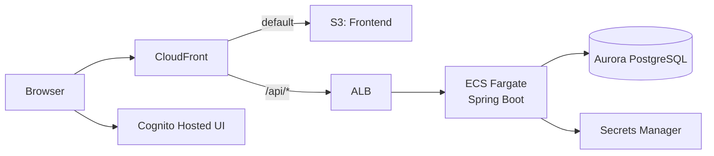
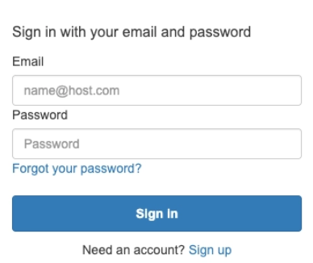
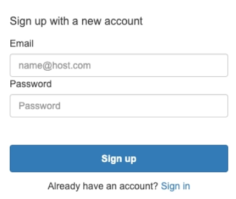

# Todo Application on AWS ECS

Spring Boot / React / AWS CDK で構成した、認証付き Todo アプリケーションのサンプルです。  
このリポジトリでは、アプリ実装と AWS インフラ定義を 1 つのモノレポで管理します。

## システム概要



- フロントエンドは CloudFront 経由で配信されます。
- API は `/api/*` で ALB -> ECS の経路にルーティングされます。
- 認証は Cognito Hosted UI（Authorization Code + PKCE）を利用します。

## 最初に読むドキュメント

1. 全体像: [docs/README.md](./docs/README.md)
2. AWS デプロイ手順: [docs/development/aws-deployment-manual.md](./docs/development/aws-deployment-manual.md)
3. サブプロジェクト入口:
   - [backend/README.md](./backend/README.md)
   - [frontend/README.md](./frontend/README.md)
   - [infra/README.md](./infra/README.md)

## ディレクトリ構成

| ディレクトリ | 役割 |
| --- | --- |
| `backend/` | Spring Boot API（`/api/todos`） |
| `frontend/` | React + Vite の SPA |
| `infra/` | AWS CDK（TypeScript）によるインフラ定義 |
| `docs/` | 詳細ドキュメントと ADR |

## 技術スタック

### Backend
- Java 21
- Spring Boot
- Spring Security（OAuth2 Resource Server）
- Spring Data JPA / Flyway
- PostgreSQL（Aurora Serverless v2）

### Frontend
- React
- TypeScript
- Vite
- Cognito Hosted UI + PKCE

### Infrastructure
- AWS CDK v2
- Amazon ECS on Fargate
- Amazon ECR
- Amazon CloudFront
- Amazon Cognito
- Application Load Balancer
- AWS Secrets Manager
- Amazon Aurora Serverless v2 (PostgreSQL)
- Amazon S3

## 前提条件

- Node.js 20.19 以上（frontend のビルド要件）
- Java 21（backend）
- Docker（CDK 実行時のコンテナイメージビルドで利用）
- AWS CLI
- AWS CDK v2
- AWS 利用可能な認証情報（必要に応じて AssumeRole）

## デプロイ後のアクセス

デプロイ後は CloudFormation 出力値から URL を確認します。

1. スタック `InfraStack-<env>` を開く
2. 出力 `TodoAppCloudFrontDomainName` を確認する
3. `https://<TodoAppCloudFrontDomainName>/` にアクセスする

```text
例: https://d31esqfuca50la.cloudfront.net/
```


### ログイン画面（Cognito Hosted UI）





## ADR（設計判断）

- [ADR 001: プロジェクト構成](./docs/adr/001-project-structure.md)
- [ADR 002: ネットワーク基盤と環境切替方式](./docs/adr/002-network-baseline-and-env-switching.md)
