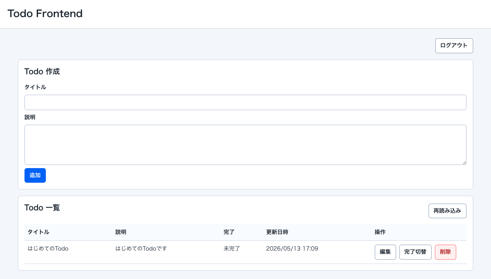

# Todo Application on AWS ECS

このプロジェクトはTodoアプリケーションです。  
Spring Boot（バックエンド）、React（フロントエンド）、AWS Aurora Serverless v2 PostgreSQL（データベース）を使用しています。  
インフラストラクチャはAWS CDKで定義されています。  

- Spring Boot による backend アプリケーション
- React による frontend アプリケーション
- AWS リソースを作成し、backend と frontend をデプロイする AWS CDK（TypeScript）


## プロジェクト構成
全体の Git 管理は `Todo-ECS-Sample` をルートプロジェクトとして行い、その配下に以下の 4 つのサブプロジェクトを配置するモノレポ構成(monorepo / monolithic repository)です。  

1. `backend/`  
   Spring Boot アプリケーションを配置する

2. `frontend/`  
   React アプリケーションを配置する

3. `infra/`  
   AWS CDK（TypeScript）プロジェクトを配置し、AWS リソースの作成と backend / frontend のデプロイを担う

ディレクトリ構成は以下とする。
```text
Todo-ECS-Sample/   <- ルートプロジェクト (git管理)
 │
 ├── backend/      <- Spring Boot プロジェクト
 │
 ├── frontend/     <- React プロジェクト
 │
 ├── infra/        <- AWS CDK (TypeScript) プロジェクト
 │
 ├── README.md
 └── .gitignore
```

## 技術
### バックエンド
- Java 21
- Spring Boot
- Spring Data JPA
- Flyway 8
- PostgreSQL

### フロントエンド
- React
- TypeScript
- AWS Amplify

### インフラストラクチャ
- AWS CDK
- AWS ECS on Fargate
- Amazon ECR
- Amazon CloudFront
- Amazon Cognito
- ALB
- AWS Secrets Manager
- AWS Aurora Serverless v2 PostgreSQL
- Amazon S3

## 前提条件
- Node.js 16.x
- AWS CLI
- AWS CDK v2.x
- Docker
- AWS Account
- IntelliJ IDEA (本プロジェクトではIntelliJを使用しているが他のIDEでも可)

## Todo サンプルアプリケーション
[AWS デプロイ手順（Monorepo 全体）](./docs/development/aws-deployment-manual.md)でforntend、backendをAWSにデプロイ後、Todo　アプリケーションのURLを取得してアクセスします。
Todo　アプリケーションのURLはAWSマネージメントコンソール(CloudFormation)から取得してください。

CloudFormationのスタック:InfraStack-prod -> [出力]タブ -> **TodoAppCloudFrontDomainName**でアクセスできます。
```text
https://TodoAppCloudFrontDomainName/

例: https://d31esqfuca50la.cloudfront.net/
```



## ADR (アーキテクチャ決定記録)
[プロジェクト構成](./docs/adr/001-project-structure.md)

## ドキュメント入口
- [docs/README.md](./docs/README.md)
- [backend/README.md](./backend/README.md)
- [infra/README.md](./infra/README.md)
- [AWS デプロイ手順（Monorepo 全体）](./docs/development/aws-deployment-manual.md)
