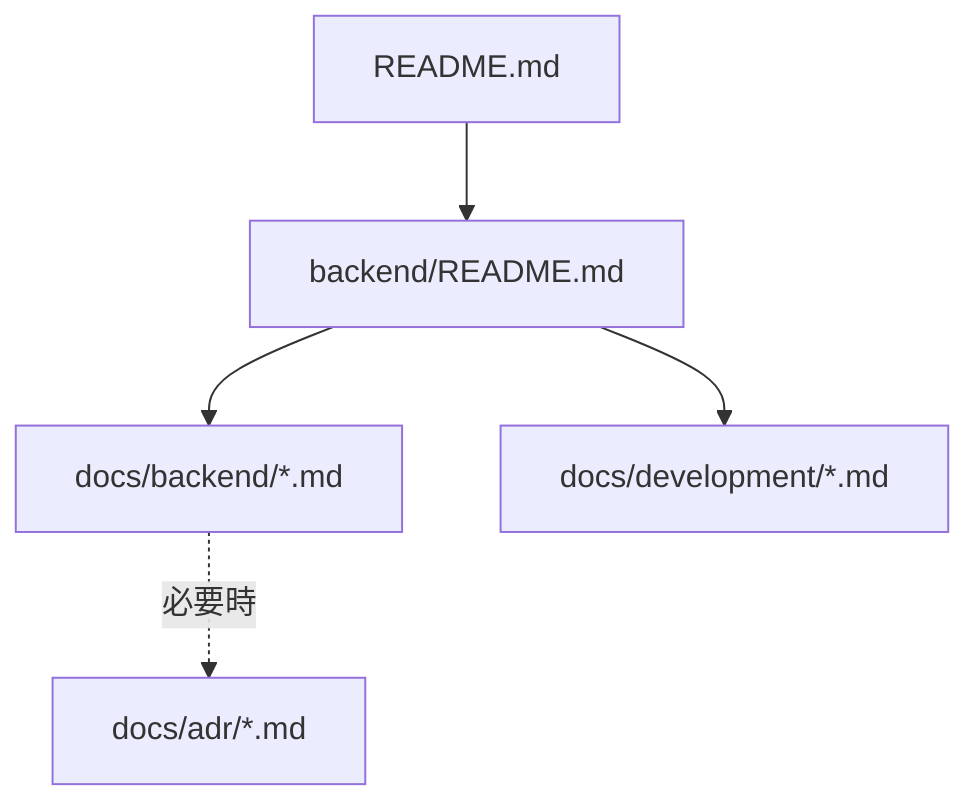

# Spec: 007-create-backend-documents

## 概要
- 既存の `backend/` 実装（Spring Boot + JPA/Flyway + Cognito JWT 検証）を分析し、欠落しているバックエンド文書を整備する。
- 文書の主対象は `backend/README.md`、`docs/backend/`、`docs/development/`、必要時の `docs/adr/` とする。
- Must 要件として、Todo アプリケーションの ER 図（Mermaid）をドキュメントへ追加する。

## 背景
- 現在のリポジトリには `docs/infra/` は存在するが、バックエンドの入口文書（`backend/README.md`）と詳細文書（`docs/backend/`）が未整備である。
- バックエンドはすでに以下を実装済みであり、文書化不足が保守リスクになっている。
  - `/api/todos` の CRUD + 一覧検索（ページング/ソート/絞り込み）
  - Cognito issuer 前提の JWT Resource Server 構成
  - `owner_subject` 境界を持つ Todo 永続化（JPA + Flyway + PostgreSQL）
  - ALB ヘルスチェック前提の `/actuator/health` 公開
- AWS 上の実行前提（CloudFront -> ALB -> ECS -> Aurora、Secrets Manager 経由設定）とバックエンド仕様の接続点を文書で追える状態にする必要がある。

## 目的
- バックエンド仕様・運用前提・開発手順を日本語ドキュメントとして標準化し、実装との対応関係を明確にする。
- API 契約、セキュリティ境界、データモデルを可視化し、変更時の影響分析を容易にする。
- 新規参加者・運用担当者が、コードをすべて読まなくても最低限の判断ができる状態を作る。

## スコープ
- 変更対象は **複数領域**（`backend/` と `docs/`）。
- 本 feature で扱う範囲:
  - `backend/README.md` の作成または更新（バックエンドの入口情報）
  - `docs/backend/` の新規作成（API・設計・データモデル・運用前提）
  - `docs/development/` の作成または更新（ローカル実行と検証手順）
  - 必要に応じた `docs/adr/` の追加または更新（重要判断の記録）
  - 追加文書への導線整備（関連 README / docs から辿れる状態）

### 想定ドキュメント構造

## 対象外
- `backend/src/` の機能追加・挙動変更・DB スキーマ変更。
- `infra/` の CDK 定義変更（CloudFront/Cognito/ECS/Aurora/ALB 構成変更）。
- `frontend/` の実装変更。
- CI/CD パイプライン新規構築やデプロイ戦略変更。

## ユーザーストーリー / 利用シナリオ
- バックエンド開発者として、`backend/README.md` からセットアップ・起動・テスト手順をすぐ把握したい。
- API 利用者として、`docs/backend/` で `/api/todos` の契約とエラーフォーマットを確認したい。
- 運用担当者として、JWT 検証前提・ヘルスチェック・環境変数/Secrets 依存を確認したい。
- 設計レビュー担当者として、ER 図で `todos` テーブル構造と `owner_subject` 境界を短時間で理解したい。

## 機能要件
- FR-01: 文書化対象は既存実装・既存設定・既存ドキュメントを根拠に整理し、未確認事項は未確定として明記すること。
- FR-02: `backend/README.md` に以下を含めること。
  - バックエンド概要と責務
  - 前提（Java 21、Maven Wrapper、Docker）
  - 主要コマンド（build/test/run）
  - 主要設定値（`SPRING_DATASOURCE_*`、`SPRING_SECURITY_OAUTH2_RESOURCESERVER_JWT_ISSUER_URI`）
  - 詳細ドキュメントへのリンク
- FR-03: `docs/backend/` に API 仕様を作成し、以下を記載すること。
  - `/api/todos` CRUD エンドポイント
  - 一覧条件（`page`, `size`, `sort`, `completed`, `q`）
  - 認証必須条件と例外（`/actuator/health`）
  - Problem Details ベースのエラー応答
- FR-04: `docs/backend/` にバックエンド設計文書を作成し、Controller/Service/Repository 分離と `owner_subject` によるデータ境界を明記すること。
- FR-05: セキュリティ仕様として、JWT issuer 検証と `token_use=access` 検証方針を記載すること。
- FR-06: データモデル文書を作成し、`todos` テーブルのカラム、制約、インデックス、`updated_at` トリガーを記載すること。
- FR-07: **Todo アプリケーションの ER 図（Mermaid）を必須で追加すること。**
- FR-08: `docs/development/` に、ローカル検証手順（少なくとも `./mvnw test` と起動手順）および H2（テスト）と PostgreSQL/Aurora（本番想定）の差分注意を記載すること。
- FR-09: 追加文書は孤立させず、既存 README または docs 入口から辿れるようにすること。
- FR-10: 重要な設計判断を新規に定義・変更する場合は `docs/adr/` へ記録すること。

## 非機能要件
- NFR-01: すべての文書を日本語で記述すること。
- NFR-02: 記載内容は実装整合性を満たし、パス・ポート・環境変数・認証条件の不整合を含まないこと。
- NFR-03: 図表（Mermaid）はレンダリング可能であること。
- NFR-04: 認証情報・シークレット実値を文書に記載しないこと。
- NFR-05: README は入口、`docs/` は詳細という責務分離を維持すること。
- NFR-06: 運用観点として、ECS/Aurora/Cognito/CloudFront との接続前提が追跡可能であること。

## 受け入れ条件
- `backend/specs/007-create-backend-documents/specs.md` に定義した対象文書が作成または更新されている。
- `backend/README.md` が存在し、起動・検証・設定の入口情報がある。
- `docs/backend/` が存在し、API 仕様・設計/セキュリティ仕様・データモデル仕様が記載されている。
- Todo ER 図（Mermaid）が文書に含まれている。
- `docs/development/` にバックエンド開発/検証手順が記載されている。
- 文書導線が整備され、追加文書が孤立していない。
- 文書と実装の整合が確認できる（`/actuator/health`、JWT issuer、`owner_subject`、Flyway/JPA 方針）。

## 制約
- 文書化 feature のため、実装コード・インフラ定義の挙動変更は行わないこと。
- 既存ディレクトリ責務（README/Docs/ADR）を維持すること。
- 既存 AWS 構成を前提に記述し、未実装事項を実装済みとして断定しないこと。
- 曖昧な項目は「未確定事項 / 要確認事項」に分離すること。

## 依存関係
- `backend/` 既存実装（Todo API、SecurityConfig、Flyway、Entity/Repository、テストコード）。
- `infra/` 既存実装と `docs/infra/`（ECS/Aurora/CloudFront/Cognito の運用前提）。
- 既存 ADR（`docs/adr/001`, `docs/adr/002`）。
- AGENTS ルール（ルート `AGENTS.md`、`backend/AGENTS.md`、必要時 `docs/AGENTS.md`）。

## 未確定事項 / 要確認事項
- `docs/README.md` を新規作成して docs 全体の入口を作るか、既存 README への追記で対応するか。
- `docs/backend/` の分割方針（API/設計/データモデルを分割するか、単一文書に集約するか）。
- ADR 追加方針（今回は追認記録まで行うか、新規意思決定のみ記録するか）。
- ER 図の対象範囲を現行実装（`todos` 単体）に限定するか、将来想定エンティティを補助記載するか。
