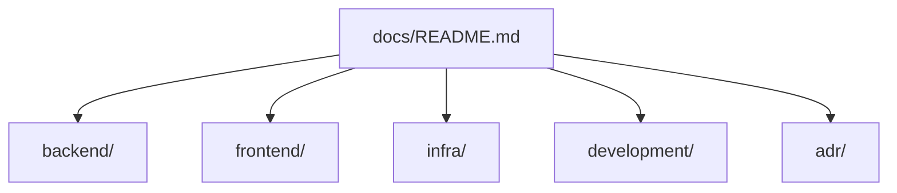

# docs

このディレクトリは、リポジトリ全体の詳細情報を管理するための入口です。  
「何を知りたいか」から、該当ドキュメントへ最短で辿れるように構成しています。

## まずどこを読むか

| 知りたいこと | 参照先 |
| --- | --- |
| AWS へデプロイする手順 | [development/aws-deployment-manual.md](./development/aws-deployment-manual.md) |
| backend API の仕様 | [backend/api.md](./backend/api.md) |
| backend の設計とセキュリティ方針 | [backend/architecture-security.md](./backend/architecture-security.md) |
| backend の DB モデル | [backend/data-model.md](./backend/data-model.md) |
| frontend の認証・runtime 設定 | [frontend/README.md](./frontend/README.md) |
| infra の構成方針 | [infra/ecs-aurora-runtime-baseline.md](./infra/ecs-aurora-runtime-baseline.md) |
| 設計判断の背景 | [adr/](./adr/) |

## 構成

## ディレクトリ別リンク

### backend
- [backend ドキュメント入口](./backend/README.md)
- [API 仕様](./backend/api.md)
- [設計・セキュリティ](./backend/architecture-security.md)
- [データモデル](./backend/data-model.md)

### frontend
- [frontend ドキュメント入口](./frontend/README.md)

### infra
- [ネットワーク基盤](./infra/network-baseline.md)
- [ECR イメージ配布](./infra/ecr-image-deployment.md)
- [ECS + Aurora + CloudFront + Cognito 実行基盤](./infra/ecs-aurora-runtime-baseline.md)
- [Cognito 負荷試験ユーザー運用手順](./infra/cognito-load-test-user-operations.md)

### development
- [backend 開発手順](./development/backend-development.md)
- [AWS デプロイ手順（Monorepo 全体）](./development/aws-deployment-manual.md)

### adr
- [ADR 001: プロジェクト構成](./adr/001-project-structure.md)
- [ADR 002: ネットワーク基盤と環境切替方式](./adr/002-network-baseline-and-env-switching.md)

## 更新時のルール（要約）

- 入口情報は README に、詳細は各サブディレクトリに配置する。
- 文書を追加したら、この `docs/README.md` から辿れるようにリンクを追加する。
- 仕様変更時は、関連する README と `docs/` の両方を更新対象として確認する。
