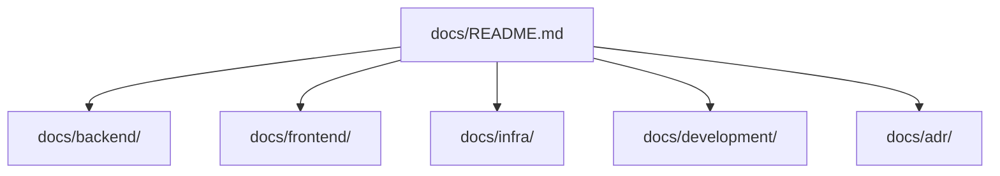

# docs

このディレクトリは、リポジトリ全体の詳細ドキュメントを管理します。  
入口（README）から各領域の詳細へ辿れる構成にします。

## ドキュメント構成

## 領域別ドキュメント

- backend
  - [backend ドキュメント入口](./backend/README.md)
  - [API 仕様](./backend/api.md)
  - [設計・セキュリティ](./backend/architecture-security.md)
  - [データモデル](./backend/data-model.md)
- frontend
  - [frontend ドキュメント入口](./frontend/README.md)
- infra
  - [ネットワーク基盤](./infra/network-baseline.md)
  - [ECR イメージ配布](./infra/ecr-image-deployment.md)
  - [ECS + Aurora 実行基盤](./infra/ecs-aurora-runtime-baseline.md)
- development
  - [backend 開発手順](./development/backend-development.md)
- adr
  - [ADR 001: プロジェクト構成](./adr/001-project-structure.md)
  - [ADR 002: ネットワーク基盤と環境切替方式](./adr/002-network-baseline-and-env-switching.md)

## 運用ルール

- 入口情報は README に置き、詳細仕様は各サブディレクトリ配下に置きます。
- 新規文書を追加した場合は、このファイルから辿れるようにリンクを追加します。
