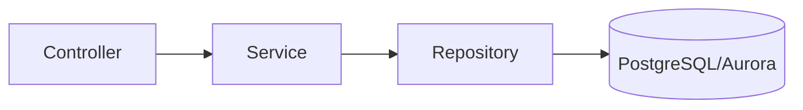
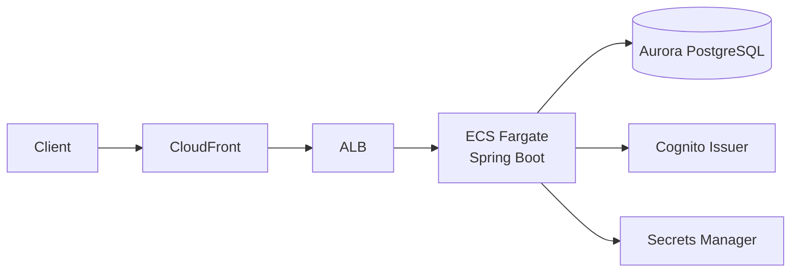

# Backend 設計・セキュリティ

## この文書の対象

- backend の責務分離（レイヤ構成）
- API 保護の方針（認証・認可）
- AWS 実行基盤との接続ポイント

## 設計方針（要点）

- レイヤ構成は `Controller -> Service -> Repository` を採用します。
- API はステートレスで運用し、JWT を必須にします。
- すべての Todo 操作に `owner_subject` 境界を適用し、ユーザー越境を防ぎます。

## レイヤ構成

### Controller
- HTTP 契約（パラメータ、バリデーション、レスポンス）を扱う
- `Authentication#getName()` から `owner_subject` を解決する

### Service
- 入力正規化と業務ルール（ページング上限、sort 検証など）を扱う
- 404/400 の業務エラー方針を統一する

### Repository
- `owner_subject` 条件付きの検索・更新・削除を共通化する

## 認証・認可

### アクセス制御

- 匿名許可: `/actuator/health`
- 認証必須: `/api/**`
- その他パス: `denyAll`

### JWT 検証

- issuer 検証: `spring.security.oauth2.resourceserver.jwt.issuer-uri`
- JWK セット URL: issuer から `/.well-known/jwks.json` を導出
- 追加検証: `token_use=access` を必須化
- principal: JWT `sub`

## 所有者境界（owner_subject）

- `owner_subject` はクライアント入力を受け付けません。
- JWT `sub` からサーバー側で決定します。
- 以下の操作はすべて `owner_subject` 条件を必須にします。
  - 単票取得
  - 更新
  - 削除
  - 一覧検索
- 未存在と権限不整合は `404 Not Found` で統一します。

## 例外とエラー形式

- `BadRequestException`: `400 Bad Request`
- `TodoNotFoundException`: `404 Not Found`
- `MethodArgumentNotValidException`: `400 Bad Request`（`errors` 配列付き）
- レスポンス形式は Problem Details（`application/problem+json`）

## AWS 実行基盤との接続点

- DB 接続情報は `SPRING_DATASOURCE_*` として ECS タスクへ注入されます。
- JWT issuer は `SPRING_SECURITY_OAUTH2_RESOURCESERVER_JWT_ISSUER_URI` で切り替えます。
- ALB ヘルスチェック用に `/actuator/health` を公開しています。

## 関連

- [API 仕様](./api.md)
- [データモデル](./data-model.md)
