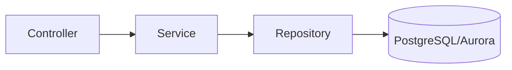
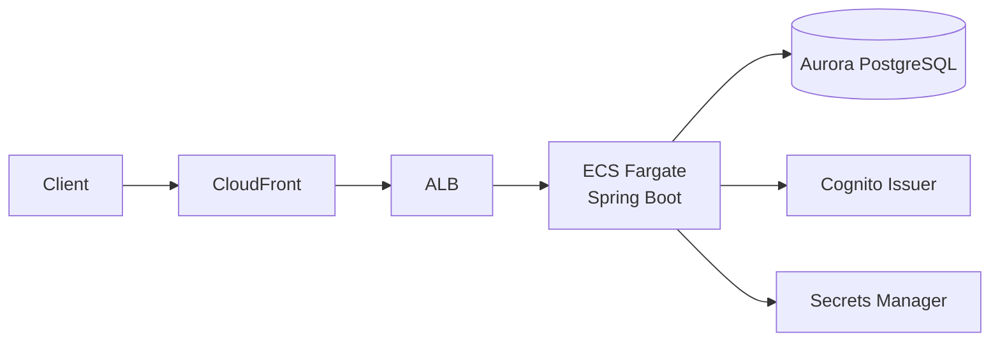

# Backend 設計・セキュリティ

## 結論

- レイヤ構成は `Controller -> Service -> Repository` を維持し、責務分離を明確にしています。
- セキュリティは Spring Security Resource Server で JWT を検証し、API をステートレスに保護しています。
- データアクセスは `owner_subject` を必須境界として強制し、ユーザー間の越境参照を防止しています。

## レイヤ構成

- Controller
  - HTTP 契約（パラメータ/バリデーション/レスポンス）を扱う
  - `Authentication#getName()` から `owner_subject` を解決する
- Service
  - 入力正規化と業務ルール（ページング上限、sort 検証、境界条件）を扱う
- Repository
  - `owner_subject` 条件付きの取得/存在確認/削除を共通化する

## 認証・認可方針

### アクセス制御

- 匿名許可: `/actuator/health`
- 認証必須: `/api/**`
- その他パス: deny all

### JWT 検証

- issuer 検証: `spring.security.oauth2.resourceserver.jwt.issuer-uri`
- JWK セット: issuer から `/.well-known/jwks.json` を導出
- 追加検証: `token_use=access` を必須化
- principal: JWT `sub` を採用

## API 境界（owner_subject）

- `owner_subject` はリクエストボディで受け取らず、JWT `sub` からサーバー側で決定します。
- 以下の操作はすべて `owner_subject` 条件付きです。
  - 単票取得
  - 更新
  - 削除
  - 一覧検索
- 権限不整合と未存在は `404 Not Found` に統一します。

## 例外とエラー形式

- `BadRequestException`: `400 Bad Request`
- `TodoNotFoundException`: `404 Not Found`
- `MethodArgumentNotValidException`: `400 Bad Request`（`errors` 配列付き）
- 返却形式は Problem Details（`application/problem+json`）です。

## AWS 実行基盤との接続点

- DB 接続情報は ECS タスクへ `SPRING_DATASOURCE_*` として注入されます。
- JWT issuer は環境変数 `SPRING_SECURITY_OAUTH2_RESOURCESERVER_JWT_ISSUER_URI` で切り替えます。
- ALB ヘルスチェック前提として `/actuator/health` を公開しています。
