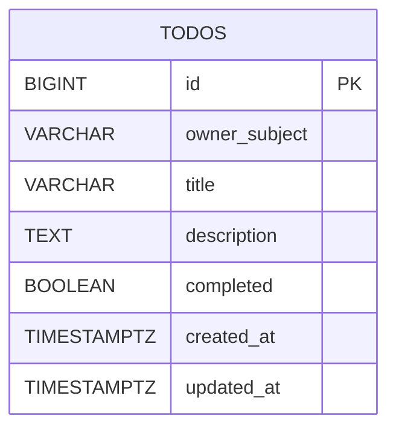

# Backend データモデル

## 結論

- 現行実装の永続化対象は `todos` テーブル単体です。
- 所有者境界は `owner_subject` で表現し、Cognito `sub` と対応づけます。
- `updated_at` は DB トリガーで更新し、更新順インデックスで一覧性能を確保しています。

## テーブル仕様（todos）

| カラム | 型 | NULL | デフォルト | 説明 |
| --- | --- | --- | --- | --- |
| `id` | `BIGINT` | NO | IDENTITY | 主キー |
| `owner_subject` | `VARCHAR(128)` | NO | なし | 所有者識別子（JWT `sub`） |
| `title` | `VARCHAR(255)` | NO | なし | タイトル |
| `description` | `TEXT` | YES | なし | 詳細説明 |
| `completed` | `BOOLEAN` | NO | `FALSE` | 完了フラグ |
| `created_at` | `TIMESTAMPTZ` | NO | `CURRENT_TIMESTAMP` | 作成日時 |
| `updated_at` | `TIMESTAMPTZ` | NO | `CURRENT_TIMESTAMP` | 更新日時 |

## 制約

- 主キー: `id`
- `title` 空白禁止チェック:
  - `chk_todos_title_not_blank CHECK (length(btrim(title)) > 0)`

## インデックス

- `idx_todos_owner_subject_updated_at`
  - `(owner_subject, updated_at DESC)`
- `idx_todos_owner_subject_completed_updated_at`
  - `(owner_subject, completed, updated_at DESC)`

## トリガー

- `set_updated_at()` 関数 + `trg_todos_set_updated_at` トリガーで、UPDATE 時に `updated_at` を自動更新します。

## ER 図（現行実装範囲）

以下の ER 図は **`todos` 単体**を対象とします。

## 実装上の対応

- Flyway 定義:
  - `backend/src/main/resources/db/migration/V1__create_todos_table.sql`
- JPA エンティティ:
  - `backend/src/main/java/com/example/backend/model/Todo.java`
