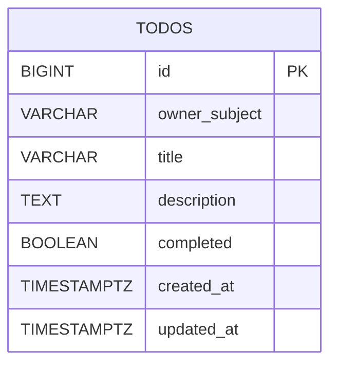

# Backend データモデル

## この文書の対象

- `todos` テーブルの定義
- 制約・インデックス・トリガー
- 実装ファイルとの対応

## 要点

- 現行実装の永続化対象は `todos` テーブル単体です。
- 所有者境界は `owner_subject` で表現し、Cognito `sub` と対応づけます。
- `updated_at` は DB トリガーで更新し、更新順の取得性能を維持します。

## テーブル仕様（`todos`）

| カラム | 型 | NULL | デフォルト | 説明 |
| --- | --- | --- | --- | --- |
| `id` | `BIGINT` | NO | IDENTITY | 主キー |
| `owner_subject` | `VARCHAR(128)` | NO | なし | 所有者識別子（JWT `sub`） |
| `title` | `VARCHAR(255)` | NO | なし | タイトル |
| `description` | `TEXT` | YES | なし | 説明 |
| `completed` | `BOOLEAN` | NO | `FALSE` | 完了フラグ |
| `created_at` | `TIMESTAMPTZ` | NO | `CURRENT_TIMESTAMP` | 作成日時 |
| `updated_at` | `TIMESTAMPTZ` | NO | `CURRENT_TIMESTAMP` | 更新日時 |

## 制約

- 主キー: `id`
- タイトル空白禁止:
  - `chk_todos_title_not_blank CHECK (length(btrim(title)) > 0)`

## インデックス

- `idx_todos_owner_subject_updated_at`
  - `(owner_subject, updated_at DESC)`
- `idx_todos_owner_subject_completed_updated_at`
  - `(owner_subject, completed, updated_at DESC)`

## トリガー

- `set_updated_at()` 関数
- `trg_todos_set_updated_at`
  - `UPDATE` 時に `updated_at` を自動更新

## ER 図

## 実装ファイル

- Flyway: `backend/src/main/resources/db/migration/V1__create_todos_table.sql`
- JPA Entity: `backend/src/main/java/com/example/backend/model/Todo.java`

## 関連

- [API 仕様](./api.md)
- [設計・セキュリティ](./architecture-security.md)
