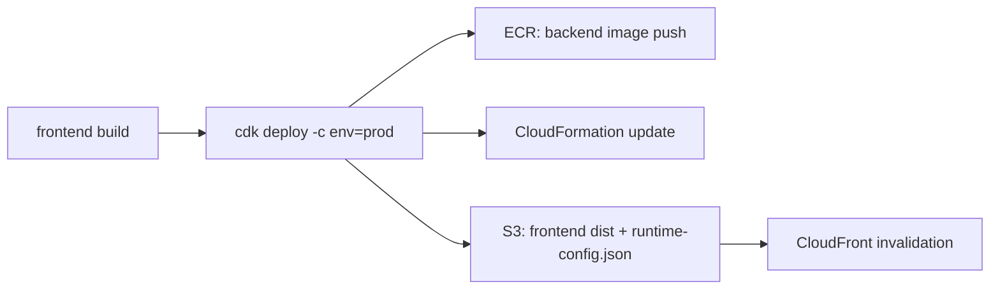

# AWS デプロイ手順（Monorepo 全体）

## 結論
- 本手順は、`frontend/`・`backend/`・`infra/` で構成されたモノレポを AWS へデプロイするための標準手順です。
- 対象はローカル開発手順ではなく、AWS へのプロビジョニング / ビルド / デプロイです。
- 実行順序は `frontend build -> cdk synth/diff（推奨）-> cdk deploy` です。
- `cdk deploy` では次が同時に実行されます。
  - `backend/` の Docker イメージを ECR へ配布（`imagedeploy.DockerImageDeployment`）
  - CloudFormation による AWS リソース更新
  - `frontend/dist` と `runtime-config.json` の S3 配備（`BucketDeployment`）

## 背景
- `infra/lib/infra-stack.ts` は `frontend/dist` の存在を必須としており、未ビルド状態では CDK 実行時に失敗します。
- `imagedeploy.DockerImageDeployment` が backend コンテナイメージをビルドするため、ローカルでコンテナランタイムの起動が必要です。
- デプロイ作業を `prod` で再現可能にするため、コマンド例は `-c env=prod` を中心に記載します。

## 詳細

### 構成と責務



### 0. 前提条件
- AWS 認証情報が対象アカウントに対して利用可能であること（必要に応じて AssumeRole）。
- `Node.js` / `npm` / `AWS CLI` / `AWS CDK v2` が利用可能であること。
- ローカルでコンテナランタイムが起動していること（例: Docker Desktop / Rancher Desktop）。
  - `imagedeploy.DockerImageDeployment` のビルド時に必要です。
- 環境切替は `-c env=<dev|stg|prod>` を使用すること。
  - `env` 未指定は `infra/bin/infra.ts` でエラー終了します。

### 0.1 対象アカウント設定（`prod`）の事前確認
- 環境マッピング（account/region）は `infra/lib/config/environment-config.ts` で管理します。
- `prod` にデプロイする前に、必ず `prod` の `accountId` と `region` が対象環境に一致していることを確認してください。
- 例（`infra/lib/config/environment-config.ts`）:

```ts
prod: {
  environmentName: 'prod',
  accountId: '111111111111',
  region: 'ap-northeast-1',
},
```

- 上記の `accountId` / `region` はサンプル値です。実運用では対象 AWS アカウント/リージョン値に合わせて事前設定してください。
- この設定と、実際に利用する AWS 認証情報（AssumeRole 先含む）が一致していない場合、誤デプロイまたは権限エラーの原因になります。

### 1. 初回セットアップ（1回のみ）
- 目的: CDK Toolkit スタックを対象アカウント/リージョンへ作成するため。
- `infra/` で実行します。

```bash
cd infra
npx cdk bootstrap aws://111111111111/ap-northeast-1
```

補足:
- 上記は `prod` 相当の例です（`environment-config.ts` の `prod` 定義）。
- `dev` / `stg` で実行する場合は、対象アカウント/リージョンを対応値に置き換えます。

### 2. frontend をビルド
- `frontend/` で静的成果物を生成します。

```bash
cd frontend
npm install
npm run build
```

確認:
- `frontend/dist` が生成されていること。

### 3. CDK 事前確認（推奨）
- `infra/` でテンプレート生成と差分確認を行います。

```bash
cd infra
npm install
npx cdk synth -c env=prod
npx cdk diff -c env=prod
```

### 4. デプロイ実行（prod 例）
- `infra/` でデプロイします。

```bash
cd infra
npx cdk deploy -c env=prod
```

実行時に行われること:
- backend Docker イメージのビルドと ECR への配布（`latest`）。
- CloudFormation スタック更新。
- `frontend/dist` と `runtime-config.json` の S3 配備、および CloudFront invalidation。

### 5. デプロイ後の確認
- `cdk deploy` 出力（または CloudFormation Outputs）から以下を確認します。
  - `TodoAppCloudFrontDomainName`
  - `TodoAppCognitoHostedUiBaseUrl`
  - `TodoAppCognitoUserPoolClientId`
  - `TodoAppCognitoCallbackUrl`
  - `TodoAppCognitoLogoutUrl`
- ブラウザで CloudFront ドメインにアクセスし、トップ画面が表示されることを確認します。
- Cognito Hosted UI ログイン後、`/api/*` 経路で backend API が疎通することを確認します。

### 6. 代表的な失敗ケースと切り分け
- `frontend/dist` がない
  - 症状: `cdk synth/diff/deploy` 実行時に asset 関連エラー。
  - 対応: `frontend/` で `npm run build` を再実行する。
- コンテナランタイムが停止している
  - 症状: `imagedeploy.DockerImageDeployment` のビルド失敗。
  - 対応: Docker Desktop / Rancher Desktop を起動後、再実行する。
- AWS 権限不足（AssumeRole / ECR / CloudFormation）
  - 症状: `AccessDenied`、`sts:AssumeRole` 失敗、ECR push 失敗。
  - 対応: 利用プロファイルとロール権限を確認し、対象アカウント権限を満たす認証で再実行する。
