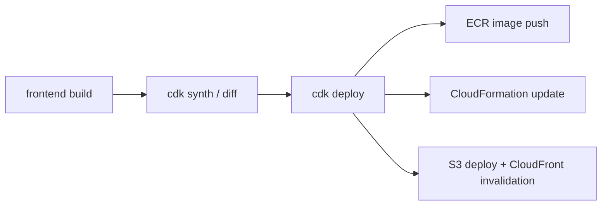

# AWS デプロイ手順（Monorepo 全体）

## この手順の対象

- `frontend/`・`backend/`・`infra/` で構成された本モノレポを AWS へデプロイする
- ローカル開発手順ではなく、AWS へのビルド/配備手順を扱う

## 先に把握しておくこと

- 実行順は `frontend build -> cdk synth/diff -> cdk deploy` です。
- `cdk deploy` 時に以下が同時に行われます。
  - backend Docker イメージの ECR 配布
  - CloudFormation によるインフラ更新
  - `frontend/dist` と `runtime-config.json` の S3 配備
- `infra/lib/infra-stack.ts` は `frontend/dist` を必須とするため、先に frontend ビルドが必要です。

## 配備フロー



## 0. 前提条件

- AWS 認証情報が対象アカウントで利用可能（必要に応じて AssumeRole）
- Node.js / npm / AWS CLI / AWS CDK v2 が利用可能
- ローカルのコンテナランタイムが起動済み（Docker Desktop など）
- 環境指定は `-c env=<dev|stg|prod>` を必ず付与

## 0.1 環境設定の確認

デプロイ先の account/region は `infra/lib/config/environment-config.ts` で管理します。  
実行前に、対象環境（例: `prod`）の値が意図した AWS アカウント/リージョンであることを確認してください。

## 1. 初回のみ: CDK Bootstrap

`infra/` で実行します。

```bash
cd infra
npx cdk bootstrap aws://<account-id>/<region> -c env=prod
```

- `<account-id>` と `<region>` は `environment-config.ts` の `prod` 定義に合わせます。
- `dev` / `stg` の場合は `-c env` と bootstrap 先を対応値に置き換えます。

## 2. frontend をビルド

```bash
cd frontend
npm install
npm run build
```

確認:
- `frontend/dist` が生成されていること

## 3. CDK 事前確認（推奨）

```bash
cd infra
npm install
npx cdk synth -c env=prod
npx cdk diff -c env=prod
```

## 4. デプロイ実行

```bash
cd infra
npx cdk deploy -c env=prod
```

## 5. デプロイ後の確認

CloudFormation 出力（または `cdk deploy` の出力）で以下を確認します。

- `TodoAppCloudFrontDomainName`
- `TodoAppCognitoHostedUiBaseUrl`
- `TodoAppCognitoUserPoolClientId`
- `TodoAppCognitoCallbackUrl`
- `TodoAppCognitoLogoutUrl`

確認ポイント:
- CloudFront ドメインで SPA が表示される
- Cognito Hosted UI でログインできる
- ログイン後に `/api/*` 経路で Todo API が利用できる

## 6. 代表的な失敗ケース

### `frontend/dist` がない
- 症状: `cdk synth/diff/deploy` で asset 関連エラー
- 対応: `frontend` で `npm run build` を再実行

### コンテナランタイム未起動
- 症状: backend イメージのビルド/配布失敗
- 対応: Docker Desktop 等を起動して再実行

### AWS 権限不足
- 症状: `AccessDenied`、`sts:AssumeRole` 失敗、ECR push 失敗
- 対応: 利用プロファイルとロール権限を確認して再実行

## 関連

- [infra 入口 README](../../infra/README.md)
- [ECS + Aurora + CloudFront + Cognito 実行基盤](../infra/ecs-aurora-runtime-baseline.md)
