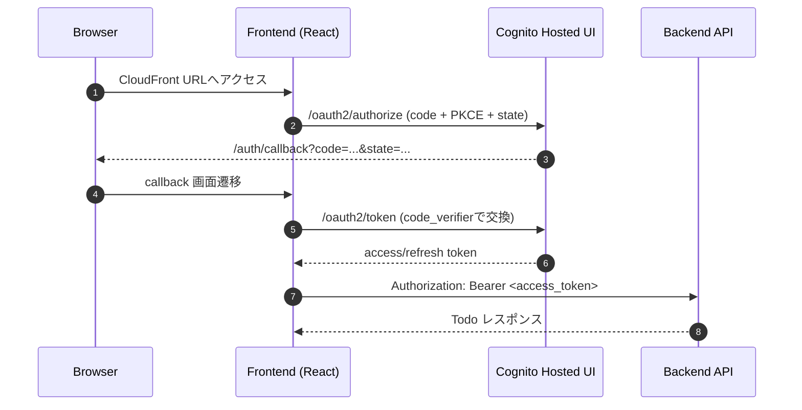

# Frontend Docs

## 結論
- `frontend/` は Cognito Hosted UI（Authorization Code + PKCE）を使って認証し、同一オリジン `/api/todos` で Todo CRUD を実行します。
- トークン保持はメモリ中心です。`localStorage` は使用せず、必要時のみ refresh token を `sessionStorage` に保存します。
- `runtime-config.json` は `infra` の `BucketDeployment` で配備時に生成し、環境ごとの差分を吸収します。

## 背景
- backend は `/api/todos` を JWT Bearer 前提で公開済みです。
- CloudFront を公開入口とし、静的配信と API 配信を同一ドメインで扱うことで CORS 設定を増やさず運用します。
- Cognito callback/logout URL は CloudFront ドメインに自動追従させ、固定 URL の手動更新を避けます。

## 詳細

### 認証フロー

### 主要仕様
- callback パス: `/auth/callback`
- API ベースパス: `/api`
- 未認証時: ログインボタン表示
- 401 応答時: 認証状態を破棄して再ログイン導線へ遷移
- ログアウト時: クライアント状態クリア後に Cognito `/logout` へ遷移

### runtime-config.json キー
- `cognitoDomain`
- `cognitoClientId`
- `oauthScopes`
- `callbackPath`
- `logoutPath`
- `apiBasePath`
- `persistRefreshToken`

### 開発時の確認手順
1. `frontend/` で `npm run dev -- --host 127.0.0.1 --port 4173` を実行する。
2. `/` と `/auth/callback` がフロントエンドへ到達することを確認する。
3. Cognito 設定入り `runtime-config.json` を用意し、ログイン・Todo CRUD・ログアウトを確認する。

## 関連
- `frontend/README.md`
- `docs/backend/api.md`
- `docs/infra/ecs-aurora-runtime-baseline.md`
