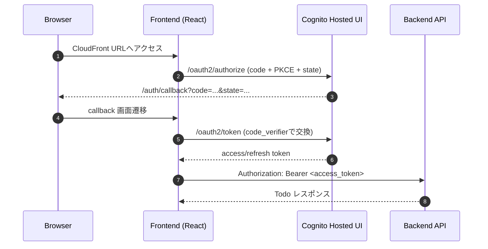

# Frontend Docs

## この文書の対象

- 認証方式（Cognito Hosted UI + PKCE）
- runtime-config の役割
- backend API との接続前提

## 要点

- `frontend/` は同一オリジンの `/api/todos` を呼び出します。
- 認証は Cognito Hosted UI（Authorization Code + PKCE）です。
- access token はメモリ保持、refresh token は必要時のみ `sessionStorage` へ保存します。
- 環境差分は `runtime-config.json` で吸収します（CDK 配備時に生成）。

## 認証フロー

## 主要仕様

- callback パス: `/auth/callback`
- logout 後の戻り先: `/`
- API ベースパス: `/api`
- 未認証時: ログイン導線を表示
- API `401` 応答時: セッションを破棄し再ログイン導線へ移行

## `runtime-config.json`

### キー一覧

- `cognitoDomain`
- `cognitoClientId`
- `oauthScopes`
- `callbackPath`
- `logoutPath`
- `apiBasePath`
- `persistRefreshToken`

### 補足

- デプロイ時は `infra` の `BucketDeployment` で自動生成します。
- ローカル確認時は `frontend/public/runtime-config.json` を手動配置します。

## 開発時の確認手順

1. `frontend/` で静的検証を実行する。
   - `npm run lint`
   - `npm run typecheck`
2. ビルドを確認する。
   - `npm run build`
3. 開発サーバーを起動する。
   - `npm run dev -- --host 127.0.0.1 --port 4173`
4. `/` と `/auth/callback` が到達することを確認する。
5. Cognito 設定入り `runtime-config.json` でログインと Todo CRUD を確認する。

## 関連

- [frontend 入口 README](../../frontend/README.md)
- [backend API 仕様](../backend/api.md)
- [infra 実行基盤](../infra/ecs-aurora-runtime-baseline.md)
