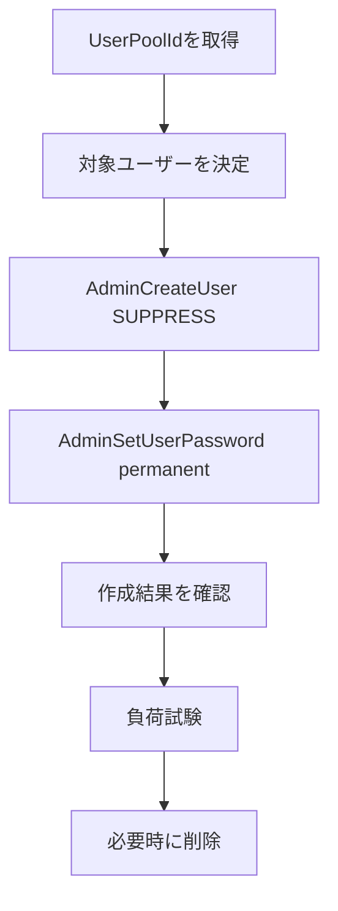

# Infra: Cognito 負荷試験ユーザー運用手順（011-cognito-password-policy）

## この文書の対象

- 負荷試験用 Cognito ユーザーの作成・削除手順
- 再実行可能な運用フロー

## 要点

- 対象は `prod` 環境の Cognito User Pool です。
- ユーザー作成は管理者 API（`AdminCreateUser`）で実施します。
- 招待メール送信は `MessageAction=SUPPRESS` で抑止します。
- 作成後に `AdminSetUserPassword --permanent` を実行し、恒久パスワード化します。
- 実行レートの目安は 1 秒あたり約 100 リクエストです。

## 前提

- 対象環境: `prod`
- 必要権限:
  - `AdminCreateUser`
  - `AdminSetUserPassword`
  - `AdminDeleteUser`
  - `ListUsers`
- 必要ツール: AWS CLI v2

## 手順フロー



## 0. 変数設定

```bash
REGION="ap-northeast-1"
STACK_NAME="InfraStack-prod"
USER_PREFIX="loadtest"
USER_DOMAIN="test.local"
USER_COUNT=100
FIXED_PASSWORD='LoadTest-Password1!'
```

## 1. User Pool ID の取得

```bash
USER_POOL_ID=$(
  aws cloudformation describe-stacks \
    --stack-name "${STACK_NAME}" \
    --region "${REGION}" \
    --query "Stacks[0].Outputs[?OutputKey=='TodoAppCognitoUserPoolId'].OutputValue | [0]" \
    --output text
)

echo "${USER_POOL_ID}"
```

## 2. ユーザー作成（再実行可能）

- 既存ユーザーは再作成しません。
- 既存/新規を問わず、毎回 `--permanent` でパスワード状態を揃えます。

```bash
for i in $(seq 1 "${USER_COUNT}"); do
  NO=$(printf "%04d" "${i}")
  EMAIL="${USER_PREFIX}-${NO}@${USER_DOMAIN}"

  EXISTS=$(
    aws cognito-idp list-users \
      --user-pool-id "${USER_POOL_ID}" \
      --region "${REGION}" \
      --filter "email = \"${EMAIL}\"" \
      --query 'length(Users)' \
      --output text
  )

  if [ "${EXISTS}" = "0" ]; then
    aws cognito-idp admin-create-user \
      --user-pool-id "${USER_POOL_ID}" \
      --region "${REGION}" \
      --username "${EMAIL}" \
      --user-attributes Name=email,Value="${EMAIL}" Name=email_verified,Value=true \
      --message-action SUPPRESS \
      --temporary-password "${FIXED_PASSWORD}"
  fi

  aws cognito-idp admin-set-user-password \
    --user-pool-id "${USER_POOL_ID}" \
    --region "${REGION}" \
    --username "${EMAIL}" \
    --password "${FIXED_PASSWORD}" \
    --permanent

  # 1秒あたり約100リクエストを目安に待機
  sleep 0.01
done
```

## 3. 作成結果の確認

```bash
aws cognito-idp list-users \
  --user-pool-id "${USER_POOL_ID}" \
  --region "${REGION}" \
  --filter "email ^= \"${USER_PREFIX}-\"" \
  --query 'Users[].Username' \
  --output text
```

## 4. テスト後の削除（任意）

```bash
for i in $(seq 1 "${USER_COUNT}"); do
  NO=$(printf "%04d" "${i}")
  EMAIL="${USER_PREFIX}-${NO}@${USER_DOMAIN}"

  EXISTS=$(
    aws cognito-idp list-users \
      --user-pool-id "${USER_POOL_ID}" \
      --region "${REGION}" \
      --filter "email = \"${EMAIL}\"" \
      --query 'length(Users)' \
      --output text
  )

  if [ "${EXISTS}" != "0" ]; then
    aws cognito-idp admin-delete-user \
      --user-pool-id "${USER_POOL_ID}" \
      --region "${REGION}" \
      --username "${EMAIL}"
  fi

  sleep 0.01
done
```

## 5. エラー時の再実行方針

- `TooManyRequestsException`:
  - `sleep` を増やして再実行
- 途中中断:
  - 同じ手順を再実行（既存ユーザーはスキップされ、状態が再整列される）
- `UsernameExistsException`:
  - 既存ユーザーとして扱い、`admin-set-user-password --permanent` を実行して継続

## 6. 運用上の注意

- 実行前に AWS Profile / Region / Stack 名を必ず確認してください。
- 固定パスワード運用は負荷試験用途に限定してください。
- 実行ログは監査用に保持する運用を推奨します。

## 関連

- [実行基盤ドキュメント](./ecs-aurora-runtime-baseline.md)
