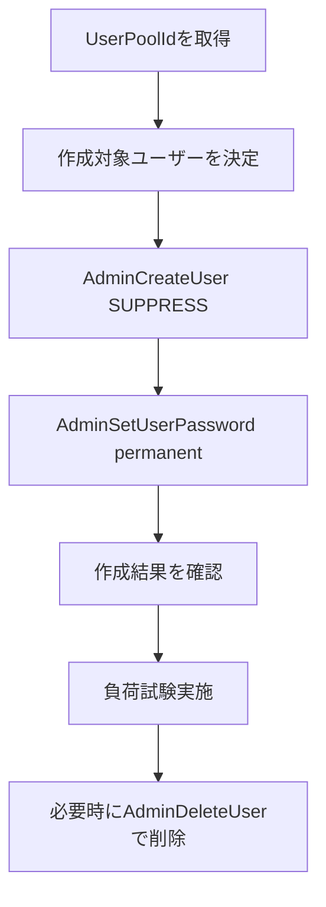

# Infra: Cognito 負荷試験ユーザー運用手順（011-cognito-password-policy）

## 結論
- Distributed Load Testing on AWS 向けの認証ユーザーは、`prod` 環境の Cognito User Pool に対して管理者APIで作成・削除する。
- ユーザー作成時は `AdminCreateUser` に `MessageAction=SUPPRESS` を指定し、招待メール送信を抑止する。
- 作成直後に `AdminSetUserPassword --permanent` を実行し、仮パスワード期限の影響を受けない状態にする。
- ユーザー識別は `loadtest-0001@test.local` のようなテスト用ドメインを用いた email 形式で管理する。
- パスワードは固定値（全ユーザー共通）で運用し、追加の保管方式は設けない。
- API 実行レートは 1 秒あたり約 100 リクエストを上限目安とする。

## 背景
- 本リポジトリの Cognito User Pool は自己登録可（`selfSignUpEnabled: true`）かつ管理者作成可（`AllowAdminCreateUserOnly: false`）の設定で運用している。
- `tempPasswordValidity` は 7 日であり、仮パスワードのままでは期限切れによる再発行運用が必要になる。
- 負荷試験を安定実施するため、管理者APIでユーザーを大量作成し、恒久パスワード化する手順を標準化する。

## 詳細

### 前提
- 対象環境: `prod`
- 実行権限: Cognito User Pool への Admin 権限相当（`AdminCreateUser` / `AdminSetUserPassword` / `AdminDeleteUser` / `ListUsers`）
- 必要ツール: AWS CLI v2

### 手順フロー



### 0. 変数設定
```bash
REGION="ap-northeast-1"
STACK_NAME="InfraStack-prod"
USER_PREFIX="loadtest"
USER_DOMAIN="test.local"
USER_COUNT=100
FIXED_PASSWORD='LoadTest-Password1!'
```

### 1. User Pool ID の取得
```bash
USER_POOL_ID=$(
  aws cloudformation describe-stacks \
    --stack-name "${STACK_NAME}" \
    --region "${REGION}" \
    --query "Stacks[0].Outputs[?OutputKey=='TodoAppCognitoUserPoolId'].OutputValue | [0]" \
    --output text
)

echo "${USER_POOL_ID}"
```

### 2. 大量ユーザーの作成（再実行可能）
- 既存ユーザーは再作成しない。
- 既存/新規を問わず、毎回 `--permanent` で固定パスワードを設定する。

```bash
for i in $(seq 1 "${USER_COUNT}"); do
  NO=$(printf "%04d" "${i}")
  EMAIL="${USER_PREFIX}-${NO}@${USER_DOMAIN}"

  EXISTS=$(
    aws cognito-idp list-users \
      --user-pool-id "${USER_POOL_ID}" \
      --region "${REGION}" \
      --filter "email = \"${EMAIL}\"" \
      --query 'length(Users)' \
      --output text
  )

  if [ "${EXISTS}" = "0" ]; then
    aws cognito-idp admin-create-user \
      --user-pool-id "${USER_POOL_ID}" \
      --region "${REGION}" \
      --username "${EMAIL}" \
      --user-attributes Name=email,Value="${EMAIL}" Name=email_verified,Value=true \
      --message-action SUPPRESS \
      --temporary-password "${FIXED_PASSWORD}"
  fi

  aws cognito-idp admin-set-user-password \
    --user-pool-id "${USER_POOL_ID}" \
    --region "${REGION}" \
    --username "${EMAIL}" \
    --password "${FIXED_PASSWORD}" \
    --permanent

  # 1秒あたり約100リクエスト上限の目安（1リクエストごとに10ms待機）
  sleep 0.01
done
```

### 3. 作成結果の確認
```bash
aws cognito-idp list-users \
  --user-pool-id "${USER_POOL_ID}" \
  --region "${REGION}" \
  --filter "email ^= \"${USER_PREFIX}-\"" \
  --query 'Users[].Username' \
  --output text
```

### 4. テスト後の削除（任意）
```bash
for i in $(seq 1 "${USER_COUNT}"); do
  NO=$(printf "%04d" "${i}")
  EMAIL="${USER_PREFIX}-${NO}@${USER_DOMAIN}"

  EXISTS=$(
    aws cognito-idp list-users \
      --user-pool-id "${USER_POOL_ID}" \
      --region "${REGION}" \
      --filter "email = \"${EMAIL}\"" \
      --query 'length(Users)' \
      --output text
  )

  if [ "${EXISTS}" != "0" ]; then
    aws cognito-idp admin-delete-user \
      --user-pool-id "${USER_POOL_ID}" \
      --region "${REGION}" \
      --username "${EMAIL}"
  fi

  sleep 0.01
done
```

### 5. エラー時の再実行方針
- `TooManyRequestsException` が発生した場合:
  - `sleep` を増やしてレートを落とし、同じループを再実行する。
- 途中中断した場合:
  - 同じ手順を再実行する。既存ユーザーは `list-users` 判定でスキップし、`admin-set-user-password --permanent` で状態を揃える。
- `UsernameExistsException` が発生した場合:
  - 既存ユーザーとして扱い、`admin-set-user-password --permanent` を実行して継続する。

### 6. 運用上の注意
- 本手順は `prod` 用の負荷試験ユーザー操作を想定する。実行前に AWS Profile / Region / Stack 名を必ず確認する。
- 固定パスワード運用のため、外部公開環境では本手順を流用しない。
- 実行ログは監査用途で保持できる運用を推奨する。
