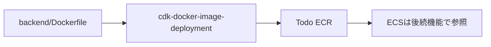

# Infra: ECR イメージ配布（004-awscdk_docker_image_deployment）

## 結論
- `infra/` の CDK で `Todo` ECR リポジトリを作成する。
- `backend/` の Dockerfile を CDK 実行時にビルドし、`latest` タグで ECR へ配布する。
- 本機能の責務は ECR 配布までとし、ECS サービス更新は対象外とする。

## 配布フロー

## 実装ルール
- ECR リポジトリ名は `Todo` とする。
- タグは固定 `latest` を利用する。
- ECR のイメージスキャン設定、ライフサイクルポリシー、タグ不変設定は本機能では採用しない。
- リポジトリ削除ポリシーは `RemovalPolicy.DESTROY` とし、サンプル要件として `prod` を含む全対象環境で同一とする。

## 運用上の注意
- `cdk synth` / `cdk diff` / `cdk deploy` 実行には Docker デーモン起動が必要。
- ECR push 権限を持つ AWS 認証で実行すること。
