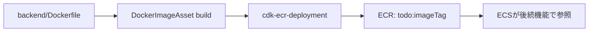

# Infra: ECR イメージ配布（004-awscdk_docker_image_deployment）

## この文書の対象

- backend イメージを ECR へ配布する仕組み
- 配布機能の責務範囲

## 要点

- CDK で ECR リポジトリ `todo` を作成します。
- `backend/` の Dockerfile を `DockerImageAsset` でビルドし、`cdk-ecr-deployment` で ECR へ配布します。
- 配布タグは `DockerImageAsset.imageTag`（イメージ内容に連動する可変タグ）を使用します。
- 本機能の責務は「ECR 配布まで」であり、ECS サービス更新は含みません。

## 配布フロー

## 実装ルール

- リポジトリ名: `todo`
- タグ: `DockerImageAsset.imageTag`（可変）
- `latest` タグは付与しない
- 本機能では未採用:
  - イメージスキャン設定
  - ライフサイクルポリシー
  - タグ不変設定
- リポジトリ削除ポリシー: `RemovalPolicy.DESTROY`

## 運用上の注意

- `cdk synth` / `cdk diff` / `cdk deploy` 実行時は Docker デーモンが必要です。
- ECR Push 権限を持つ AWS 認証で実行してください。

## 関連

- [ECS + Aurora + CloudFront + Cognito 実行基盤](./ecs-aurora-runtime-baseline.md)
