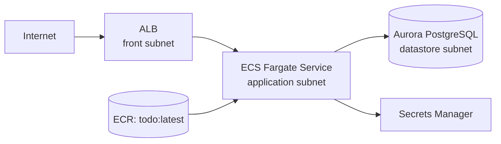

# Infra: ECS + Aurora 実行基盤（005-ecs-aurora-jpa）

## 結論
- `infra/` の CDK で、既存 VPC 上に ALB / ECS(Fargate) / Aurora Serverless v2(PostgreSQL) / Secrets Manager を追加した。
- `backend` コンテナは既存 ECR `todo:latest` を参照し、DB接続情報は Secrets Manager 経由で注入する。
- Security Group は `ALB -> ECS -> Aurora` の最小通信を基準に設定し、ECS から AWS API 利用に必要な HTTPS(443) 送信を許可する。

## 構成

## 実装ルール
- ALB は `front` サブネット、ECS は `application` サブネット、Aurora は `datastore` サブネットに配置する。
- ECS タスク定義は `todo:latest` を参照し、DB接続情報は以下を Secret で注入する。
  - `SPRING_DATASOURCE_HOST`
  - `SPRING_DATASOURCE_PORT`
  - `SPRING_DATASOURCE_DBNAME`
  - `SPRING_DATASOURCE_USERNAME`
  - `SPRING_DATASOURCE_PASSWORD`
- Aurora は Serverless v2 (`min=0.5 ACU`, `max=2 ACU`) で構成し、初期DB名は `todoapp` とする。
- ALB ヘルスチェックは現時点で `path=/` を採用し、`healthyHttpCodes=200-499` で評価する。

## Security Group 方針
- ALB SG
  - Inbound: `0.0.0.0/0 -> 80/tcp`
  - Outbound: `ECS SG -> 8080/tcp`
- ECS SG
  - Inbound: `ALB SG -> 8080/tcp`
  - Outbound: `Aurora SG -> 5432/tcp`
  - Outbound: `0.0.0.0/0 -> 443/tcp`（ECR/Logs/SecretsManager等のAWS API接続用）
- Aurora SG
  - Inbound: `ECS SG -> 5432/tcp`

## 既知事項
- `cdk synth -c env=prod` / `cdk diff -c env=prod` は、実行元アカウントが `111111111111` の CDK lookup role を Assume できない場合に失敗する。
- `cdk-docker-image-deployment` のバンドルで Node16 ランタイム警告が出る（依存ライブラリ側の挙動）。
- ECS サービスで `minHealthyPercent` 未指定の警告が出るため、本番運用時はデプロイ戦略を明示設定すること。

## 関連
- `infra/README.md`
- `docs/infra/network-baseline.md`
- `docs/infra/ecr-image-deployment.md`
