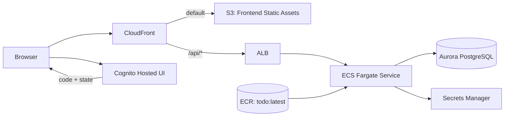

# Infra: ECS + Aurora + CloudFront + Cognito 実行基盤（005/006/008）

## この文書の対象

- 本番系の実行基盤（API + SPA + 認証）の構成
- CloudFront/S3/ALB/ECS/Aurora/Cognito の接続関係

## 要点

- 公開入口は CloudFront に統一します。
- 静的配信は S3、API は `/api/*` で ALB に転送します。
- backend は ECS Fargate 上で稼働し、Aurora/PostgreSQL を利用します。
- 認証は Cognito Hosted UI（Authorization Code + PKCE）です。

## 構成

## 実装ルール

### CloudFront

- default behavior: S3（OAC）+ `defaultRootObject=index.html`
- `/api/*`: ALB + `CACHING_DISABLED`
- API 転送時は `OriginRequestPolicy.ALL_VIEWER_EXCEPT_HOST_HEADER`
- SPA fallback: `403/404 -> /index.html (200)`

### S3

- private バケット（Block Public Access 有効）
- `BucketDeployment` で以下を配備
  - `frontend/dist`
  - `runtime-config.json`
- 配備後は `/*` を invalidation

### Cognito

- Public Client（secret なし）
- Authorization Code Flow（PKCE 前提）
- callback: `https://${distributionDomainName}/auth/callback`
- logout: `https://${distributionDomainName}/`
- Refresh Token Rotation 有効

## Security Group 方針

- ALB SG
  - Inbound: CloudFront managed prefix list -> `80/tcp`
  - Outbound: ECS SG -> `8080/tcp`
- ECS SG
  - Inbound: ALB SG -> `8080/tcp`
  - Outbound: Aurora SG -> `5432/tcp`
  - Outbound: `0.0.0.0/0 -> 443/tcp`（AWS API 接続用）
- Aurora SG
  - Inbound: ECS SG -> `5432/tcp`

## 運用上の注意

- `cdk synth/diff` は lookup role を Assume 可能な AWS 認証が必要です。
- `frontend/dist` が未生成だと `BucketDeployment` の asset 作成で失敗します。
- `cdk-docker-image-deployment` 側の依存により Node16 警告が表示される場合があります。

## 関連

- [ネットワーク基盤](./network-baseline.md)
- [ECR イメージ配布](./ecr-image-deployment.md)
- [AWS デプロイ手順](../development/aws-deployment-manual.md)
