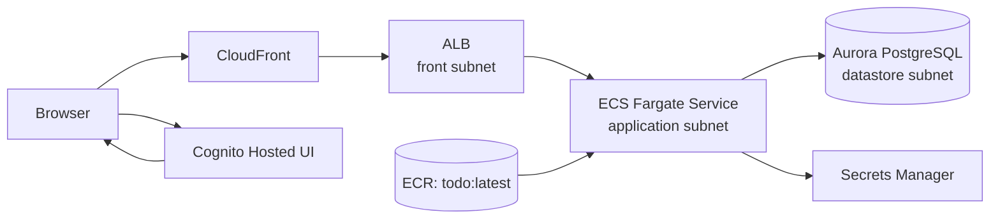

# Infra: ECS + Aurora + CloudFront + Cognito 実行基盤（005/006）

## 結論
- `infra/` の CDK で、既存 VPC 上の ALB / ECS(Fargate) / Aurora / Secrets Manager 構成に、CloudFront と Cognito を追加した。
- 公開経路は `CloudFront -> ALB -> ECS` に統一し、ALB の受信は CloudFront managed prefix list 起点へ制限する。
- 認証基盤は Cognito User Pool を採用し、App Client は Public Client（Authorization Code Flow）で構成する。

## 構成

## 実装ルール
- ALB は `front`、ECS は `application`、Aurora は `datastore` サブネットへ配置する。
- ECS タスク定義は `todo:latest` を参照し、DB 接続情報は Secret 注入（`SPRING_DATASOURCE_*`）で渡す。
- Aurora は Serverless v2 (`min=0.5 ACU`, `max=2 ACU`)、初期 DB 名は `todoapp` とする。
- ALB ヘルスチェックは `/actuator/health` で統一する。
- Cognito App Client は以下固定 URL を使用する。
  - callback: `https://d123456abcdef8.cloudfront.net/auth/callback`
  - logout: `https://d123456abcdef8.cloudfront.net/`

## Security Group 方針
- ALB SG
  - Inbound: `CloudFront managed prefix list -> 80/tcp`
  - Outbound: `ECS SG -> 8080/tcp`
- ECS SG
  - Inbound: `ALB SG -> 8080/tcp`
  - Outbound: `Aurora SG -> 5432/tcp`
  - Outbound: `0.0.0.0/0 -> 443/tcp`（ECR / Logs / Secrets Manager など AWS API 接続用）
- Aurora SG
  - Inbound: `ECS SG -> 5432/tcp`

## 既知事項
- `cdk synth -c env=prod` / `cdk diff -c env=prod` は、実行元が `111111111111` の CDK lookup role を Assume できない場合に失敗する。
- `cdk-docker-image-deployment` のバンドルで Node16 ランタイム警告が出る（依存ライブラリ側の挙動）。
- ECS Service の `minHealthyPercent` 未指定警告が出るため、本番運用ではデプロイ戦略の明示が必要。

## 関連
- `infra/README.md`
- `docs/infra/network-baseline.md`
- `docs/infra/ecr-image-deployment.md`
