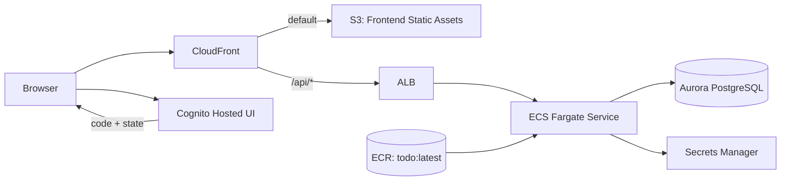

# Infra: ECS + Aurora + CloudFront + Cognito 実行基盤（005/006/008）

## 結論
- `infra/` の CDK は `ALB/ECS/Aurora` 基盤に `CloudFront + S3 + Cognito` を統合し、SPA と API を同一ドメイン配信する構成です。
- CloudFront の default behavior は S3 静的配信、`/api/*` のみ ALB へ転送します。
- Cognito callback/logout URL は `distribution.distributionDomainName` から動的に組み立てます。

## 構成

## 実装ルール
- CloudFront
  - default: `S3(origin access control)` + `defaultRootObject=index.html`
  - `/api/*`: `ALB` + `CACHING_DISABLED` + `OriginRequestPolicy.ALL_VIEWER_EXCEPT_HOST_HEADER`
  - SPA fallback: `403/404 -> /index.html (200)`
- S3
  - private（Block Public Access 有効）
  - `BucketDeployment` で `frontend/dist` と `runtime-config.json` を配備
  - CloudFront invalidation は `/*`
- Cognito
  - App Client は Public Client（secret なし）
  - Authorization Code Flow + PKCE 前提
  - callback: `https://${distributionDomainName}/auth/callback`
  - logout: `https://${distributionDomainName}/`
  - Refresh Token Rotation 有効

## Security Group 方針
- ALB SG
  - Inbound: `CloudFront managed prefix list -> 80/tcp`
  - Outbound: `ECS SG -> 8080/tcp`
- ECS SG
  - Inbound: `ALB SG -> 8080/tcp`
  - Outbound: `Aurora SG -> 5432/tcp`
  - Outbound: `0.0.0.0/0 -> 443/tcp`（ECR / Logs / Secrets Manager など AWS API 接続用）
- Aurora SG
  - Inbound: `ECS SG -> 5432/tcp`

## 運用上の注意
- `cdk synth/diff` は lookup role を Assume できる AWS 認証が必要です。
- `frontend/dist` がない状態では `BucketDeployment` 用 asset が作成できず失敗します。
- `cdk-docker-image-deployment` のバンドルで Node16 ランタイム警告が出ることがあります（依存ライブラリ側）。

## 関連
- `infra/README.md`
- `docs/infra/network-baseline.md`
- `docs/infra/ecr-image-deployment.md`
