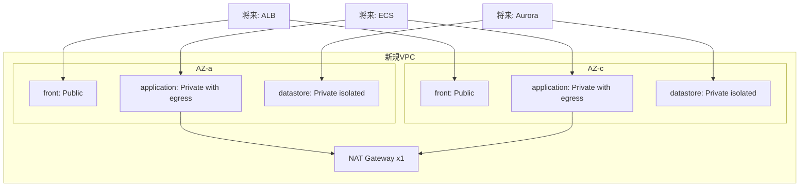

# Infra: ネットワーク基盤（002-create_network）

## 結論
- `infra/` では、環境指定（`dev` / `stg` / `prod`）で切替可能なネットワーク基盤を CDK で定義する。
- 現時点の実装は `prod` 利用を主目的とし、`prod` は `111111111111` / `ap-northeast-1` を前提とする。
- Security Group の具体ルールは本機能の対象外とし、後続の ALB/ECS/DB 実装時に各リソースと合わせて定義する。

## 背景
- デフォルトVPC依存を避け、環境差分管理と再現性を確保するため。
- 将来の `dev` / `stg` 展開を同一実装パターンで行うため。

## 構成

## 運用ルール
- 環境指定は必須: `-c env=<dev|stg|prod>`
- 環境情報は `infra/lib/config/environment-config.ts` で管理する。
- 共通タグは `env` / `service` / `version` を付与し、現時点の `version` は `1.00` を使用する。

## 既知事項
- `cdk synth -c env=prod` は、実行環境の認証状態によって失敗する場合がある（AssumeRole/証明書チェーン要因）。
- これは実装不備ではなく実行環境依存のため、認証設定を整えた環境で再実行する。

## 関連
- `infra/README.md`
- `docs/adr/002-network-baseline-and-env-switching.md`
