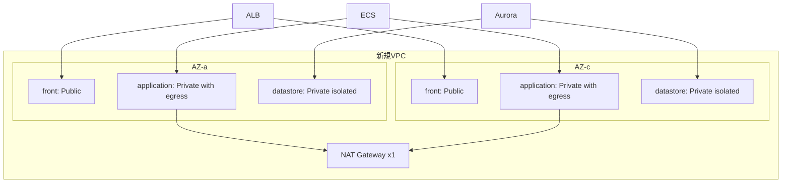

# Infra: ネットワーク基盤（002-create_network）

## この文書の対象

- VPC / サブネット構成の基本方針
- 環境切替（`dev` / `stg` / `prod`）の前提

## 要点

- デフォルト VPC は使用せず、新規 VPC を作成します。
- 2AZ・3層サブネット（`front` / `application` / `datastore`）を採用します。
- NAT Gateway は 1 台構成です。
- 環境ごとの account/region は `infra/lib/config/environment-config.ts` で管理します。

## 構成

## 運用ルール

- CDK 実行時は `-c env=<dev|stg|prod>` の指定を必須とします。
- 共通タグとして `env` / `service` / `version` を付与します。
- Security Group 詳細は後続機能（ALB/ECS/DB 構築）で定義します。

## 補足

- `cdk synth` は実行環境の認証状態（AssumeRole など）で失敗する場合があります。
- 認証設定を確認したうえで再実行してください。

## 関連

- [infra 入口 README](../../infra/README.md)
- [ADR 002](../adr/002-network-baseline-and-env-switching.md)
