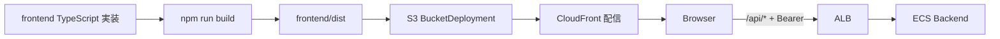

# Spec: 009-frontend-js-to-ts

## 概要
- `frontend/` の JavaScript / JSX 実装を TypeScript / TSX に移行し、既存の認証・API 利用・AWS 配備フローを維持したまま型安全性を向上させる。
- 対象は主に `frontend/` だが、移行に伴うコマンドや運用手順の差分があれば `frontend/README.md` と `docs/frontend/README.md` までを更新対象に含める。

## 背景
- 現在の `frontend/src/` は `.js` / `.jsx` で実装されており、`runtime-config.json`・Cognito Hosted UI・`/api/todos` 連携の実行時不整合をコンパイル時に検知できない。
- `infra/` は `frontend/dist` を `BucketDeployment` で S3 配備し、CloudFront で配信する設計であるため、フロントエンドのビルド成果物互換性は運用上の重要要件である。
- ルート `README.md` の技術記載（Frontend: TypeScript）と実装実態（JavaScript）の不一致があり、保守時の認識齟齬を生みやすい。

## 目的
- UI の公開挙動を変えずに、型定義に基づく静的検証を導入して回帰を減らす。
- 認証・API 呼び出し・runtime 設定の境界を型で明示し、将来変更時の影響分析を容易にする。
- AWS 配備（CloudFront/S3/Cognito/CDK）に対して非互換を持ち込まない移行基準を定義する。

## スコープ
- 変更対象は **複数領域**（主に `frontend/`、必要に応じて `docs/`）。
- 本 feature で扱う範囲:
  - `frontend/src/` の JS/JSX を TS/TSX へ移行
  - `vite.config.js` / `eslint.config.js` など設定ファイルを TypeScript 化
  - TypeScript コンパイル設定と型検証コマンドの整備
  - lint/build/typecheck を含む検証手順の整備
  - 移行に伴って必要な README / docs の更新

## 対象外
- `backend/` の API 契約変更、DB スキーマ変更、認証仕様変更。
- `infra/` の AWS リソース構成変更（CloudFront/ALB/S3/Cognito/Aurora の新規設計変更）。
- UI デザイン刷新や機能追加（Todo 項目仕様変更、新画面追加など）。
- E2E 基盤の新規導入や CI/CD 全体再設計。
- 新規の自動テスト基盤・自動テストケースの導入（必要時は別タスクで対応）。

## ユーザーストーリー / 利用シナリオ
- フロントエンド開発者として、`runtime-config` や API レスポンスの型不整合をローカルで早期検知したい。
- 運用担当者として、TypeScript 移行後も `frontend/dist` を既存 CDK フローでそのまま配備できることを確認したい。
- プロダクト利用者として、Cognito ログイン、Todo CRUD、ログアウトの体験が移行前後で変わらないことを期待する。

## 機能要件
- FR-01: `frontend/src/` の実装ファイルは TypeScript 系拡張子（`.ts` / `.tsx`）へ移行すること。
- FR-02: 移行後も `runtime-config.json` のキー契約（`cognitoDomain`、`cognitoClientId`、`oauthScopes`、`callbackPath`、`logoutPath`、`apiBasePath`、`persistRefreshToken`）を維持すること。
- FR-03: Cognito Hosted UI の Authorization Code + PKCE フロー（`/auth/callback` 復帰、token 交換、logout 遷移）を変更しないこと。
- FR-04: `/api/todos` への呼び出し仕様（Authorization ヘッダー付与、401 時のセッション破棄、Problem Details 解析）を維持すること。
- FR-05: TypeScript コンパイル設定を追加し、フロントエンド実装を静的型検証できる状態にすること。
- FR-05a: TypeScript コンパイラ設定は最終的に `strict: true` を目標とすること。
- FR-05b: 移行初期段階で既存実装への影響が大きい場合は、段階的移行として一部設定の緩和を許容すること。
- FR-05c: 新規・変更対象コードは可能な限り `strict` 前提で型付けすること。
- FR-06: `npm run build` が継続して成功し、出力先が `frontend/dist` のままであること。
- FR-07: 完了確認の必須検証として `lint`・`typecheck`・`build` を実行し、結果を記録できること。
- FR-07a: 既存の自動テストが存在する場合は、上記必須検証に加えて実行すること。
- FR-07b: 新規の自動テスト導入は本 feature のスコープ外とすること。
- FR-08: ビルド手順や検証手順に差分が出る場合、`frontend/README.md` と `docs/frontend/README.md` の更新要否を確認し、必要な更新を行うこと。
- FR-09: JavaScript 由来の曖昧型は必要最小限に抑え、`any` の常用や広範囲な型緩和を避けること。
- FR-09a: やむを得ず `any` や型アサーションを使う場合は、理由をコードコメントまたはレビュー記録で明示すること。
- FR-10: `vite.config.js` / `eslint.config.js` など設定ファイルを TypeScript 化対象に含めること。
- FR-11: ライブラリ型不足時は、`公式型定義または @types/* の導入` -> `影響範囲を限定した型定義ファイル追加` -> `局所的型アサーション` の順で対応を検討すること。

## 非機能要件
- NFR-01: セキュリティ方針（access token はメモリ中心、refresh token は `persistRefreshToken=true` 時のみ `sessionStorage`）を維持すること。
- NFR-02: CloudFront/S3 配信互換性を維持し、`runtime-config.json` の配備前提を壊さないこと。
- NFR-03: 既存の SPA ルーティング要件（`/`、`/auth/callback`、直接アクセス時の表示成立）を維持すること。
- NFR-04: 型定義は保守性を重視し、将来の API 変更時に影響箇所を追跡しやすい構造にすること。
- NFR-05: 依存ライブラリ追加は最小限とし、既存の Vite/React 構成との整合性を保つこと。
- NFR-06: TypeScript 厳格化は最終的に `strict: true` へ収束させることを前提に、段階移行時も緩和理由を追跡可能にすること。

## 受け入れ条件
- `frontend/src/` 配下に `.js` / `.jsx` 実装ファイルが残存しない（移行対象外を明示した場合を除く）。
- `vite.config.js` / `eslint.config.js` など指定した設定ファイルが TypeScript 化されている。
- `npm run lint`、TypeScript 型検証コマンド、`npm run build` が成功する。
- 既存の自動テストがある場合は、その実行結果が確認されている。
- 生成された `frontend/dist` を前提にした既存インフラ手順（`infra` の配備前提）が維持される。
- 認証導線（ログイン/コールバック/ログアウト）と Todo CRUD の主要操作が回帰していないことを確認できる。
- ドキュメント更新の要否が確認され、必要差分が反映されている。

## 制約
- 既存の公開経路（CloudFront -> `/api/*` -> ALB -> ECS）を前提とし、API パスや認証境界を変更しないこと。
- `infra/lib/infra-stack.ts` が要求する `frontend/dist` 成果物契約を維持すること。
- バックエンド・インフラの本番影響設定は、本 feature で変更しないこと。
- 移行対象は要求範囲に限定し、無関係な大規模リファクタリングを行わないこと。
- 新規自動テスト導入は本 feature では行わず、必要時は別タスクとして分離すること。

## 依存関係
- `frontend/` の既存実装（`App.jsx`、`auth/*`、`api/*`、`config/runtime-config.js`）。
- `backend` の API 契約（`/api/todos`、401 応答、Problem Details 形式）。
- `infra` の配備実装（`frontend/dist` 配備、`runtime-config.json` 注入、CloudFront/S3/Cognito 連携）。
- 既存ドキュメント（`frontend/README.md`、`docs/frontend/README.md`、`infra/README.md`、`docs/infra/*`）。
