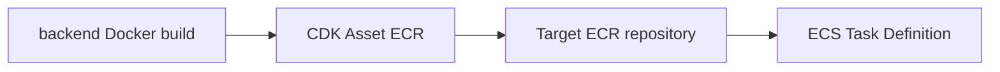

# Spec: 015-ecr-docker-deploy

## 概要
- `infra/` の Docker イメージ配布方式を `cdk-docker-image-deployment` から `cdk-ecr-deployment` v4 系へ移行する。
- ECS タスク定義が参照する backend イメージタグを `latest` 固定から、イメージ更新に追従する可変タグへ変更する。
- CDK デプロイ時に生成される Node.js 16 ランタイム Lambda を、当該機能由来では新規作成しない状態にする。

## 背景
- AWS Health 通知により、Lambda `nodejs16.x` ランタイムのサポート終了対応が必要になっている。
- 現行構成では、Docker イメージ配布用のカスタムリソース実装が Node.js 16 を使うため、アプリ本体とは別に `nodejs16.x` 関数が作成される。
- さらに ECS 側が `latest` のような固定タグ参照だと、どのイメージで稼働しているかの追跡と変更レビューが難しくなる。

## 目的
- 非推奨ランタイム依存を排除し、運用上の将来リスクを低減する。
- CDK deploy 内での build / copy 完結方針を維持したまま、配布実装を保守可能な構成へ置き換える。
- ECS のデプロイ差分から、投入イメージの変更を明確に判別できるようにする。

## スコープ
- 対象領域: `infra/`（単一領域）
- 対象内容:
  - `infra/package.json` と lock file の依存更新
  - Docker イメージ build / copy construct の置換
  - ECS タスク定義の image tag 参照方式変更（`latest` 非依存化）
  - 依存関係（デプロイ順）の明示
  - 関連ドキュメント（`infra/README.md` / `docs/infra/`）の更新要否確認

## 対象外
- Docker build / push を CI 専用フローへ移管すること
- ECS/ALB/VPC/RDS/IAM の機能追加や大規模再設計
- backend / frontend のアプリケーション実装変更
- ECR リポジトリ名変更、既存本番イメージ削除
- 本件と無関係なリファクタリング・rename・ファイル移動

## ユーザーストーリー / 利用シナリオ
- インフラ運用者として、CDK デプロイ時に非推奨 Node.js 16 ランタイムを新規作成せずに運用を継続したい。
- 開発者として、ECS タスク定義差分から「どのイメージに更新されたか」を明確に把握したい。
- レビュアーとして、`cdk diff` で本件に関係ない高リスク差分がないことを確認したい。

## 機能要件
- FR-01 依存関係の移行
  - `cdk-docker-image-deployment` 依存を削除する。
  - `cdk-ecr-deployment` v4 系を追加する。
  - 既存パッケージマネージャと lock file 運用に従って更新する。

- FR-02 Docker build の定義
  - backend イメージ build は `aws-cdk-lib/aws-ecr-assets` の `DockerImageAsset` を利用する。
  - 既存に build 引数・platform・target・exclude・cache 等の設定がある場合は、必要分を引き継ぐ。
  - build context 外依存がある場合は、asset hash に反映される方式を採用する。

- FR-03 ECR への配布
  - `cdk-ecr-deployment` の `ECRDeployment` で、`DockerImageAsset.imageUri` から管理対象 ECR へ配布する。
  - 配布タグは原則 `DockerImageAsset.imageTag` を使う。
  - 配布先は既存 ECR リポジトリを再利用し、リポジトリ作成方式は変更しない。

- FR-04 ECS イメージ参照
  - ECS タスク定義の backend コンテナは `latest` 固定を参照しない。
  - ECS が参照する repository/tag は、配布先と同一の repository/tag を指す。
  - `latest` への追加コピーが必要な場合でも、ECS 参照タグとしては使用しない。

- FR-05 デプロイ順制御
  - 初回デプロイ時に未存在タグ pull が起きないよう、ECR 配布完了後に ECS 側が評価される依存を設定する。

- FR-06 Node.js 16 ランタイムの除去（本件由来）
  - 合成テンプレート上で、本件の image 配布機能由来に `nodejs16.x` が含まれないこと。
  - 旧方式由来の Lambda / CodeBuild / Custom Resource は `cdk diff` で削除差分として確認できること。

- FR-07 既存運用互換
  - 既存の `-c env=<dev|stg|prod>` 運用、ECR 名称、ECS サービス構成を維持する。
  - 本件に不要な出力値変更や構成変更を行わない。

## 非機能要件
- セキュリティ
  - 追加されるカスタムリソース実行権限は最小権限原則を満たすこと。
  - シークレットや認証情報をコードに埋め込まないこと。

- 信頼性
  - 同一入力での再デプロイ時に破壊的挙動が発生しないこと。
  - 配布処理失敗時に原因追跡できるログ導線を維持すること。

- 運用性
  - `cdk synth` / `cdk diff` で差分意図を追跡できること。
  - 稼働中タスクが参照するイメージの識別性（タグ追跡）を向上させること。

- 保守性
  - Construct の責務分離を維持し、既存実装方針に沿った最小変更で実装できること。

## 受け入れ条件
- AC-01 依存関係
  - `package.json` から `cdk-docker-image-deployment` が削除され、`cdk-ecr-deployment` v4 系が追加されている。
  - リポジトリ内に `cdk-docker-image-deployment` の利用コードが残っていない。

- AC-02 テンプレート検証
  - `npx cdk synth` が成功する。
  - 合成テンプレートに、本件由来の `Runtime: nodejs16.x` が存在しない。
  - 旧配布方式由来リソースの削除差分と、新配布方式リソースの追加差分が `cdk diff` で確認できる。

- AC-03 ECS 参照タグ
  - ECS タスク定義の backend コンテナ image が `:latest` 固定ではない。
  - 配布先 ECR の tag と ECS 参照 tag が一致している。

- AC-04 変更影響
  - `cdk diff` で本件と無関係な高リスク変更（VPC/ALB/DB/IAM の大幅変更）が発生しない。
  - 既存 ECR リポジトリの削除・再作成差分が発生しない。

- AC-05 動作確認
  - `cdk deploy` 後に ECS Service が安定化し、backend が新タグのイメージで起動する。

## 制約
- CDK deploy で build / copy を完結させる現行運用は維持する。
- 変更範囲は `infra/` に限定し、他領域へ波及させない。
- `cdk-ecr-deployment` は third-party construct であるため、将来更新リスクを前提に利用する。
- 明示依頼なしに本番影響のある既定値を変更しない。

## 依存関係
- `infra/lib/constructs/backend-image-deployment-construct.ts`
- `infra/lib/constructs/todo-backend-ecs-service-construct.ts`
- `infra/lib/infra-stack.ts`
- `infra/package.json` / lock file
- `aws-cdk-lib`（`aws-ecr-assets`, `aws-ecs`）
- `cdk-ecr-deployment` v4 系
- Docker デーモン、AWS 認証情報、ECR への push 権限

## 未確定事項 / 要確認事項
- `latest` タグを ECS 参照外で併用する運用要否（必要なら追加コピー方針を確定する）。
- backend build が build context 外ファイルに依存しているか（依存している場合の hash 反映方式）。
- 適用対象環境の優先順位（`prod` 先行か、`dev/stg/prod` 同時か）。
- 移行後に `nodejs16.x` 関数が残る場合の扱い（別スタック由来・孤立リソースの切り分け手順）。
