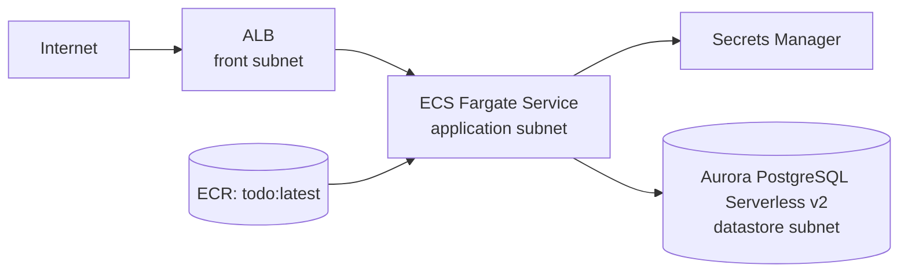

# Spec: 005-ecs-aurora-jpa

## 概要
- `infra/` の AWS CDK で ALB・ECS(Fargate)・Aurora Serverless v2(PostgreSQL)・Secrets Manager を構成し、`backend/` の Todo アプリを ECS 上で稼働可能にする。
- `backend/` では JPA エンティティ/Repository/Flyway 初期マイグレーションを整備し、Aurora PostgreSQL で Todo 永続化を行える状態にする。
- 認証基盤(Cognito)や REST API 実装は本 feature の対象外とし、後続機能で実装可能なデータモデルと実行基盤を先行して整える。

### 想定構成

## 背景
- 現在の `infra/` は 2AZ の VPC(3層サブネット)と ECR イメージ配布まで実装済みで、ECS 実行基盤と DB 永続化基盤は未実装である。
- 現在の `backend/` は Spring Boot の最小構成で、JPA エンティティ、DB スキーマ、マイグレーション、Aurora 接続設定が未整備である。
- Todo アプリを AWS 上で実運用に近い構成へ拡張するため、ALB/ECS/Aurora/Secret 連携と永続化設計を同時に確定する必要がある。

## 目的
- 既存の VPC/ECR 基盤を活用して、Todo バックエンドを ECS on Fargate で稼働できるようにする。
- Aurora PostgreSQL と Flyway により、Todo 永続化スキーマをコード管理できるようにする。
- 将来の Cognito 認証連携と Todo API 実装に備え、`owner_subject` を含むデータモデルを先行整備する。

## スコープ
- 変更対象領域は **複数領域**（`infra/` と `backend/`）。
- `infra/`:
  - 既存 VPC 上に ALB、ECS クラスター、ECS サービス(Fargate)、Aurora Serverless v2(PostgreSQL)、Secrets Manager を追加する。
  - ALB/ECS/Aurora 向け Security Group を作成し、最小権限の通信経路を定義する。
  - ECS タスクが Secrets Manager 経由で DB 接続情報を取得できるようにする。
  - 既存 ECR(`todo:latest`)を ECS タスク定義から参照する。
- `backend/`:
  - `Todo` エンティティ、`TodoRepository`、Flyway 初期マイグレーションを追加する。
  - Aurora(PostgreSQL)接続のための Spring 設定と依存ライブラリ(JPA/Flyway/PostgreSQL)を追加する。
  - `specs-draft-JPA-DB.md` の設計方針に沿って `owner_subject` 中心の永続化仕様を導入する。

## 対象外
- Todo REST API の新規実装・拡張（一覧/作成/更新/削除エンドポイント）。
- Cognito User Pool 認証・認可の実装、および JWT 解析ロジック。
- `frontend/` の画面実装・認証連携・API 連携。
- Route53/ACM/WAF を含む公開系の本番強化（独自ドメイン化、TLS 終端の最適化など）。
- CI/CD パイプラインの新規構築（CodePipeline/GitHub Actions など）。

## ユーザーストーリー / 利用シナリオ
- インフラ担当者として、`cdk deploy -c env=<env>` で Todo バックエンドの実行基盤(ALB/ECS/Aurora/Secret)を一貫して構築したい。
- バックエンド担当者として、JPA/Flyway で定義した Todo スキーマを Aurora に適用し、アプリ起動時に自動でマイグレーションしたい。
- 運用担当者として、DB 認証情報をコードや平文設定に置かず、Secrets Manager と IAM で安全に接続管理したい。

## 機能要件
- インフラ要件
  - FR-INF-01: `infra/` の CDK で ALB、ECS Cluster、ECS Service(Fargate)、Aurora Serverless v2(PostgreSQL)、Secrets Manager Secret を作成すること。
  - FR-INF-02: 既存 VPC のサブネット責務を維持し、ALB は `front`、ECS は `application`、Aurora は `datastore` サブネットに配置すること。
  - FR-INF-03: Security Group は以下の最小通信を満たすこと。  
    - ALB SG: 外部からの HTTP(将来 HTTPS 追加可能)受信、ECS SG へのアプリポート送信。  
    - ECS SG: ALB SG からのアプリポート受信のみ許可、Aurora SG への 5432 送信を許可。  
    - Aurora SG: ECS SG からの 5432 受信のみ許可。
  - FR-INF-04: ECS タスク定義は既存 ECR リポジトリ `todo` の `latest` イメージを利用すること。
  - FR-INF-05: アプリケーションは 2AZ 構成で稼働できるように設計し、ECS/Aurora ともに 2AZ を前提としたサブネット配置を行うこと。
  - FR-INF-06: DB 接続情報（ユーザー名/パスワード/エンドポイント/DB名等）は Secrets Manager で管理し、ECS タスクへ Secret 経由で注入すること。
  - FR-INF-07: ECS タスクロールには Secrets Manager の参照に必要な最小 IAM 権限のみを付与すること。
  - FR-INF-08: ECS サービスのヘルスチェック成立に必要な ALB ターゲットグループ設定（ポート/パス/成功コード）を定義すること。
- バックエンド要件
  - FR-BE-01: Spring Boot に JPA/Flyway/PostgreSQL 接続のための依存関係を追加すること。
  - FR-BE-02: `Todo` 永続化エンティティは `specs-draft-JPA-DB.md` の方針に沿って、`todos` テーブルと以下の属性を扱うこと。  
    `id`, `owner_subject`, `title`, `description`, `completed`, `created_at`, `updated_at`
  - FR-BE-03: `owner_subject` を Todo 所有者識別子として必須項目で保持し、`users` テーブルは本 feature では作成しないこと。
  - FR-BE-04: Repository は `JpaRepository<Todo, Long>` と `JpaSpecificationExecutor<Todo>` を利用し、所有者条件を前提とした検索を可能にすること。
  - FR-BE-05: Flyway 初期マイグレーションで `todos` テーブル、主なインデックス、`updated_at` 自動更新トリガーを作成すること。
  - FR-BE-06: アプリ起動時に Flyway が実行され、Aurora PostgreSQL に初期スキーマが適用されること。
  - FR-BE-07: DB 接続設定は環境変数/Secrets 参照で構成し、接続情報をソースコードへハードコードしないこと。

## 非機能要件
- セキュリティ
  - DB 認証情報は Secrets Manager 管理とし、平文の固定値を禁止する。
  - SG/IAM は最小権限とし、不要な双方向通信やワイルドカード権限を避ける。
- 可用性
  - 既存 VPC の 2AZ 構成を維持し、ALB/ECS/Aurora を AZ 障害を考慮した配置にする。
- 運用性
  - ECS のアプリログは CloudWatch Logs で追跡可能にする。
  - デプロイ後に ALB 到達性、ECS タスク稼働、Aurora 接続可否を確認できる状態にする。
- 保守性
  - `infra` は既存の Stack/Construct 分割方針を維持し、責務を混在させない。
  - `backend` は Entity/Repository/マイグレーションの責務を分離し、後続 API 実装で再利用可能な構造にする。
- 性能
  - `owner_subject` を先頭とするインデックスを作成し、ユーザ単位アクセスの拡張に備える。

## 受け入れ条件
- `cdk synth -c env=<env>` で ALB、ECS(Fargate)、Aurora、Secrets Manager、関連 SG がテンプレートに出力される。
- SG ルールが「ALB -> ECS -> Aurora」の最小経路に限定され、Aurora が外部公開されない。
- ECS タスク定義が `todo:latest` を参照し、DB 接続情報を Secret から取得する構成になっている。
- `backend/` に Todo エンティティ/Repository/Flyway マイグレーションが追加され、`todos` テーブル仕様が `specs-draft-JPA-DB.md` と整合する。
- Flyway 初期マイグレーションに `owner_subject`、必要インデックス、`updated_at` 更新トリガーが含まれる。
- 本仕様に、REST API 実装と Cognito 認証実装が対象外であることが明示されている。

## 制約
- 既存の環境切替ルール（`-c env=<dev|stg|prod>`）を維持すること。
- 既存 VPC（2AZ/3層サブネット）を再利用し、別 VPC の新設は行わないこと。
- 既存 ECR 配布仕様（`todo` リポジトリ、`latest` タグ）を前提に ECS 側を構成すること。
- 変更は `infra/` と `backend/` に限定し、`frontend/` は変更しないこと。
- `specs-draft-JPA-DB.md` に記載のうち、Cognito 認証フローや REST API 契約に関する事項は本 feature の拘束範囲に含めないこと。

## 依存関係
- `infra/` 既存実装（VPC 基盤、ECR イメージ配布、環境設定 `environment-config.ts`）。
- `backend/` 既存 Spring Boot プロジェクト（Maven Wrapper、Docker イメージ化済み）。
- AWS 実行権限（CDK デプロイ権限、ECS/ECR/RDS/Secrets Manager/IAM 作成権限）。
- 後続機能（Cognito 認証連携、Todo REST API 実装、フロントエンド連携）。

## 未確定事項 / 要確認事項
- ALB の公開方式（HTTP のみで開始するか、初期段階から HTTPS/ACM を必須化するか）。
- 環境別の ECS desiredCount / オートスケーリング方針（全環境で固定か、`dev/stg/prod` で差分を持つか）。
- Aurora Serverless v2 の容量設定（最小/最大 ACU）と運用時のコスト上限。
- ALB ヘルスチェックの最終パス定義（`/actuator/health` を標準とするか、別パスにするか）。
- Cognito 未導入期間における `owner_subject` の入力元（ダミー運用可否）と検証方針。
