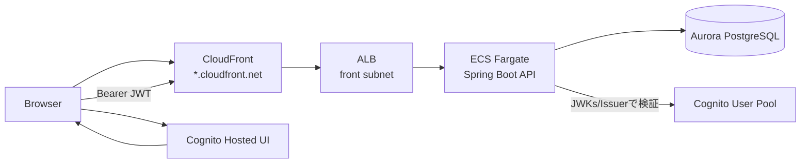

# Spec: 006-api-and-springboot-controller-service

## 概要
- `infra/` の AWS CDK に、`CloudFront -> ALB -> ECS(Fargate)` の公開経路と、Amazon Cognito User Pool を中心とした認証基盤を追加する。
- `backend/` の Spring Boot に、Todo の RESTful API（Controller/Service 層）と、Cognito JWT を検証する Resource Server 構成を追加する。
- `frontend/` の Hosted UI ログイン実装は本 feature の対象外とし、実装可能な基盤（Cognito ドメイン・App Client・API 認証方式）を先行整備する。

### 想定構成

## 背景
- 既存の `005-ecs-aurora-jpa` で、ALB/ECS/Aurora/Secrets Manager による実行基盤と永続化基盤は整備済み。
- ただし、外部公開の標準入口（CloudFront）、ユーザー認証基盤（Cognito）、アプリケーション API 層（Controller/Service）、JWT 認証は未整備。
- Todo を「ユーザー単位で安全に操作する API」として成立させるには、公開経路・認証基盤・API 層を同時に定義する必要がある。

## 目的
- CloudFront 経由の API 公開に統一し、ALB 直アクセスを抑止できる構成にする。
- Cognito が発行する JWT を Spring Security Resource Server で検証し、`owner_subject` と `sub` を一貫して扱えるようにする。
- Controller -> Service -> Repository の責務分離を維持したまま、Todo CRUD API の最小機能を提供する。

## スコープ
- 変更対象領域は **複数領域**（`infra/` と `backend/`）。
- `infra/`:
  - CloudFront Distribution（ALB origin）を追加する。
  - Cognito User Pool / App Client / User Pool Domain（Hosted UI 用）を追加する。
  - CloudFront 導入に合わせて ALB の公開制御を見直し、直アクセス抑止の構成を入れる。
  - backend が JWT 検証に必要な設定値（issuer / userPoolId / appClientId / hosted UI domain 等）を参照可能にする。
- `backend/`:
  - `controllers` パッケージに Todo API コントローラを追加する。
  - `services` パッケージに Service インターフェースと実装を追加する。
  - 既存 `TodoRepository` を活用し、必要な検索・更新処理を Service 層経由で提供する。
  - Spring Security OAuth2 Resource Server (JWT) を有効化する。

## 対象外
- `frontend/` における Hosted UI ログイン実装・トークン保持・画面遷移実装。
- 独自ドメイン（Route53）および ACM 証明書発行の導入。
- ALB 側の Cognito/OIDC 認証機能の採用（本 feature では backend JWT 検証を採用）。
- WAF、Shield Advanced、Bot 対策などの高度な公開防御。
- 多要素認証（MFA）、外部 IdP 連携（Google/SAML/OIDC Federation）の詳細設計。

## ユーザーストーリー / 利用シナリオ
- エンドユーザーとして、Cognito Hosted UI でログイン後、取得した JWT を使って Todo API を利用したい。
- バックエンド開発者として、JWT の `sub` を所有者識別子として Todo を安全に CRUD したい。
- インフラ担当者として、`cdk deploy -c env=<env>` で CloudFront/Cognito/API 公開経路を一貫管理したい。
- 運用担当者として、CloudFront ドメイン・Cognito 設定値・API 到達性をデプロイ成果物から確認したい。

## 機能要件
- インフラ要件
  - FR-INF-01: `infra/` の CDK で CloudFront Distribution を作成し、origin を既存 ALB に設定すること。
  - FR-INF-02: CloudFront の公開エンドポイントはデフォルトドメイン（`*.cloudfront.net`）と標準証明書を利用し、独自ドメインは導入しないこと。
  - FR-INF-03: Viewer Protocol Policy は HTTPS 強制（`redirect-to-https` または `https-only`）とすること。
  - FR-INF-04: API 用 behavior は `GET/HEAD/OPTIONS/PUT/PATCH/POST/DELETE` を origin に転送可能とし、認証付き API の誤キャッシュを避けるためキャッシュ無効（TTL 0 相当）を採用すること。
  - FR-INF-05: Authorization ヘッダーを backend に転送し、JWT Bearer 認証が成立すること。
  - FR-INF-06: ALB への直接到達を抑止するため、ALB の受信制御を CloudFront managed prefix list 起点に制限すること。
  - FR-INF-07: Cognito User Pool を作成し、User Pool 認証を本システムのユーザー認証基盤として利用すること。
  - FR-INF-08: Cognito Hosted UI 利用のために User Pool Domain を作成すること（`amazoncognito.com` のプレフィックスドメイン）。
  - FR-INF-09: React SPA 想定の App Client を作成し、Public Client（client secret なし）として Authorization Code + PKCE を前提に設定すること。
  - FR-INF-10: Cognito App Client の callback URL / logout URL は prod 環境 URL を設定すること。
  - FR-INF-11: Cognito のユーザー登録方式は自己登録可、MFA 不要、簡易的なパスワードポリシーとすること。
  - FR-INF-12: backend JWT 検証に必要な識別子（Issuer URI、User Pool ID、App Client ID）を環境ごとに一意に参照できること。
  - FR-INF-13: ALB ターゲットグループのヘルスチェックパスは `/actuator/health` に統一すること。
  - FR-INF-14: 既存の `ALB -> ECS -> Aurora` 通信要件（最小権限 SG、Secrets Manager 利用、2AZ 前提）を維持すること。
  - FR-INF-15: 既存の環境切替方式（`-c env=<dev|stg|prod>`）と共通タグ運用（`env`/`service`/`version`）を維持すること。
- バックエンド要件
  - FR-BE-01: `backend/` に Todo API の Spring MVC Controller を追加し、`/api/todos` を基点とした CRUD エンドポイントを提供すること。
  - FR-BE-02: Controller は Service 層のみを呼び出し、Repository へ直接アクセスしないこと。
  - FR-BE-03: Service 層は interface と implementation を分離し、永続化は既存 `TodoRepository` を通じて行うこと。
  - FR-BE-04: すべての Todo 操作は JWT の `sub` を `owner_subject` として扱い、他ユーザーのデータにアクセスできないこと。
  - FR-BE-05: Todo の新規作成・更新で `owner_subject` をリクエストボディから受け付けないこと（サーバー側で JWT から決定する）。
  - FR-BE-06: Spring Security OAuth2 Resource Server を有効化し、Cognito JWT の署名と `iss` を検証すること。
  - FR-BE-07: 受け付けるトークン種別は `access token` を前提とし、`token_use` などを検証して不正トークンを拒否できること。
  - FR-BE-08: サンプル要件として JWT の厳密検証は簡易運用とし、`client_id`/scope の強制検証は必須としないこと。
  - FR-BE-09: 認証必須エンドポイントでトークン欠落/不正時は 401、権限不整合時は 403 または 404 のいずれかに統一し、仕様で定義すること。
  - FR-BE-10: API エンドポイント詳細契約（ページング、ソート、部分更新方針、エラーフォーマット）は一般的な REST API 設計に準拠すること。
  - FR-BE-11: Todo 入力値は既存 DB 制約と整合するバリデーションを実施すること（例: `title` 必須、長さ制約）。
  - FR-BE-12: backend の API 実装で、既存 Flyway/JPA/DB 接続設定（Aurora + Secrets 注入）との互換性を維持すること。

## 非機能要件
- セキュリティ
  - API 認証は Bearer JWT を必須とし、匿名アクセスを禁止する（ヘルスチェック等の運用上必要な経路は例外として明示）。
  - ALB のインターネット直アクセスを許容しない構成とし、CloudFront 経由公開を徹底する。
  - Cognito App Client は Public Client として設計し、client secret のフロント埋め込みを禁止する。
- 可用性
  - 既存 2AZ 構成（VPC/ECS/Aurora）を維持し、単一 AZ 依存を増やさない。
- 性能
  - 認証付き Todo API はキャッシュ無効を基本とし、ユーザー間データ混在を防止する。
- 運用性
  - デプロイ後に CloudFront ドメイン、Cognito User Pool/App Client 識別子、ALB 到達性を確認できること。
  - 既存 CloudWatch Logs を継続利用し、認証失敗や API エラーを追跡可能にすること。
- 保守性
  - `infra` は既存 Construct 分割方針（SRP）を維持し、Stack へ責務を過密化しない。
  - `backend` は Controller/Service/Repository の責務分離を維持する。

## 受け入れ条件
- `npx cdk synth -c env=<env>` で CloudFront Distribution と Cognito（User Pool / App Client / Domain）がテンプレートに出力される。
- CloudFront の viewer 側 HTTPS 強制設定と、ALB origin 連携設定が確認できる。
- ALB への直接アクセス抑止策（CloudFront managed prefix list 起点制限）が SG/構成に反映されている。
- Cognito App Client の callback URL / logout URL が prod 環境 URL で定義されている。
- ALB ターゲットグループのヘルスチェックパスが `/actuator/health` で定義されている。
- backend に Todo Controller・Service interface・Service 実装が追加され、Controller から Service 経由で CRUD 処理される。
- `/api/todos` 系エンドポイントが JWT 必須となり、トークン未指定時に 401 を返す。
- JWT の `sub` と `owner_subject` の対応でデータ分離が成立し、他ユーザーの Todo を操作できない。
- JWT 検証で少なくとも署名・`iss`・トークン用途（access token）を検証し、不正トークンを拒否できる（`client_id`/scope の厳密検証は必須外）。
- 既存 DB 接続（Aurora + Secrets 注入）と Flyway/JPA 動作を阻害しない。

## 制約
- 既存の環境切替ルール `-c env=<dev|stg|prod>` を維持すること。
- 既存 ECR/ECS/Aurora 構成を前提に、変更は `infra/` と `backend/` に限定すること。
- 独自ドメイン・ACM を使わない要件のため、CloudFront -> ALB 間 TLS を必須化しない（origin 通信方式は要件制約下で決定）。
- CloudFront managed prefix list を採用するため、Security Group ルール数クォータ（prefix list weight）への影響を考慮すること。

## 依存関係
- 既存 `infra/` 実装（VPC、ALB、ECS、Aurora、Secrets Manager、環境設定）。
- 既存 `backend/` 実装（Todo Entity/Repository、Flyway マイグレーション、JPA 設定）。
- Spring Security OAuth2 Resource Server 関連依存ライブラリ。
- AWS サービス: CloudFront, Cognito User Pools, ALB, ECS, Aurora, Secrets Manager, CloudWatch Logs。
