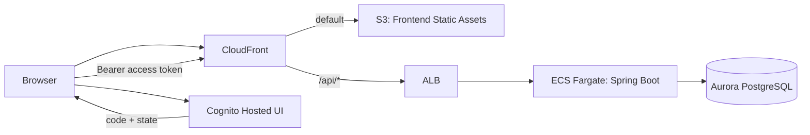

# Spec: 008-frontend-basic

## 概要
- Todo アプリケーションの SPA フロントエンドを `frontend/` に実装し、既存 `backend/` API（`/api/todos`）と連携して認証付き CRUD を提供する。
- フロントエンドのビルド成果物は `infra/` の AWS CDK から `s3deploy.BucketDeployment` で S3 に配置し、CloudFront 経由で配信する。
- 認証は既存の Cognito User Pool / App Client / Hosted UI を利用し、フロントエンドでログインして取得した JWT を backend が検証する既存方針を維持する。

### 想定構成

## 背景
- `backend/` は JWT 認証付き Todo API（`/api/todos`）が実装済みで、`owner_subject` 境界のデータ分離も実装済みである。
- `infra/` は CloudFront -> ALB -> ECS の API 公開経路と Cognito 基盤まで実装済みだが、静的フロントエンド配信（S3 origin）は未実装である。
- `frontend/` は Vite の初期テンプレート（JavaScript ベース）が配置されており、業務 UI・認証導線・API 連携が未実装である。
- 現状の Cognito callback/logout URL は固定プレースホルダ値であり、CloudFront 自動生成ドメインと自動整合する方式へ置き換える必要がある。

## 目的
- エンドユーザーが CloudFront 公開 URL から Todo SPA にアクセスし、Cognito Hosted UI ログイン後に Todo を操作できる状態を作る。
- 静的アセット配信を S3 + CloudFront に統一し、API 通信は同一 CloudFront ドメインの `/api/*` 経由で backend に到達させる。
- フロントエンドのビルド方法とデプロイ前提（設定値、手順、検証方法）をドキュメント化し、再現可能性を担保する。

## スコープ
- 変更対象領域は **複数領域**（`frontend/`、`infra/`、`docs/`）。
- `frontend/`
  - Todo 一覧/作成/更新/削除の UI と API クライアントを実装する。
  - Cognito Hosted UI（Authorization Code + PKCE）を使ったログイン/コールバック/ログアウト導線を実装する。
  - 認証状態に応じた画面制御（未認証時のログイン誘導、401 時の再認証）を実装する。
- `infra/`
  - フロントエンド配信用 S3 バケットと `s3deploy.BucketDeployment` を追加する。
  - 既存 CloudFront Distribution を「S3 静的配信 + `/api/*` の ALB 転送」構成に変更する。
  - フロントエンド実 URL と Cognito callback/logout URL の整合をとる。
- `docs/`
  - フロントエンドのビルド方法、設定値、配備前提、確認手順を日本語で更新する。
- `backend/`
  - 既存 API 契約と JWT 検証実装を利用し、原則コード変更は行わない（契約不整合が判明した場合のみ別 feature で扱う）。

## 対象外
- 新規 API 追加、既存 Todo API 契約の大幅変更。
- 独自ドメイン（Route53）や ACM 証明書発行を伴う公開経路変更。
- WAF、Shield Advanced、Bot 対策などの高度な公開防御。
- CI/CD パイプラインの新規構築（CodePipeline / GitHub Actions など）。
- ネイティブアプリ対応、PWA オフライン対応、プッシュ通知対応。
- Cognito MFA 必須化や外部 IdP 連携（Google/SAML/OIDC Federation）の導入。
- UI の詳細デザイン基準（コンポーネントライブラリ採用可否、テーマ方針、ビジュアルガイドラインの確定）。
- `frontend/` の JavaScript から TypeScript への全面移行（別 feature で実施）。

## ユーザーストーリー / 利用シナリオ
- エンドユーザーとして、CloudFront の URL にアクセスし、Cognito Hosted UI でログインして自分の Todo を管理したい。
- エンドユーザーとして、他ユーザーの Todo が混在しない安全な一覧・更新・削除を行いたい。
- フロントエンド開発者として、既存 backend API 契約に沿ってローカルビルドと動作確認を再現したい。
- インフラ担当者として、`cdk deploy -c env=<env>` の流れで静的配信と API 経路を一貫して管理したい。

## 機能要件
- フロントエンド要件
  - FR-FE-01: `frontend/` の初期テンプレート画面を Todo アプリ画面へ置き換え、一覧/作成/更新/削除を実行できること。
  - FR-FE-02: Todo 操作は `docs/backend/api.md` の契約（`/api/todos`、ページング、バリデーション、エラー形式）に従うこと。
  - FR-FE-03: 未認証ユーザーは Todo API を呼び出さず、Cognito Hosted UI ログインへ遷移可能であること。
  - FR-FE-04: ログインは Authorization Code + PKCE を前提とし、callback で `code` / `state` を検証してトークン取得すること。
  - FR-FE-05: backend 呼び出し時は `Authorization: Bearer <access_token>` を付与すること。
  - FR-FE-06: 認証エラー（401）時はトークンを破棄して再ログイン導線へ遷移すること。
  - FR-FE-07: ログアウト時はクライアント側の認証状態をクリアし、Cognito Hosted UI logout エンドポイントへ遷移すること。
  - FR-FE-08: API 通信先は同一 CloudFront ドメイン配下（`/api/*`）を前提とし、追加 CORS 設定なしで通信できること。
  - FR-FE-09: 画面にはローディング状態、空状態、主要エラー状態（認証失敗/入力エラー/通信失敗）を表示できること。
  - FR-FE-10: ビルド成果物は `vite build` の標準出力（`frontend/dist`）を利用すること。
  - FR-FE-11: フロントエンド設定値（Cognito domain/clientId、redirect URI 等）はコード直書きを避け、環境切替可能な注入方式を採用すること。
  - FR-FE-12: トークン保持はメモリ中心とし、`localStorage` へアクセストークン/リフレッシュトークンを保存しないこと。
  - FR-FE-13: 永続化が必要な場合のみリフレッシュトークンを `sessionStorage` に保存可能とし、アクセストークンは保存しないこと。
  - FR-FE-14: Cognito App Client は Refresh Token Rotation を有効化し、フロントエンド実装はローテーション前提でトークン更新すること。
- インフラ要件
  - FR-INF-01: CDK でフロントエンド静的配信用 S3 バケットを作成し、公開設定は private（Block Public Access 有効）とすること。
  - FR-INF-02: `s3deploy.BucketDeployment` により `frontend/dist` の成果物を S3 に配置できること。
  - FR-INF-03: CloudFront Distribution は default behavior を S3 origin とし、静的アセット配信を担うこと。
  - FR-INF-04: CloudFront に `/api/*` behavior を追加し、origin を既存 ALB に設定すること。
  - FR-INF-05: `/api/*` behavior は認証付き API の誤キャッシュ回避のため cache 無効（TTL 0 相当）かつ Authorization ヘッダー転送を維持すること。
  - FR-INF-06: viewer 側は HTTPS 強制を維持し、ALB 受信制限（CloudFront managed prefix list 起点）を維持すること。
  - FR-INF-07: SPA の直接 URL アクセス（例: `/auth/callback`）で 404 にならない配信制御を行うこと。
  - FR-INF-08: Cognito App Client の callback URL / logout URL は CloudFront の `distribution.distributionDomainName` から組み立てた URL を直接設定し、配信先フロントエンド URL と自動整合させること。
  - FR-INF-09: CloudFront ドメイン名、Cognito Hosted UI base URL、App Client ID など frontend 設定に必要な値を出力または参照可能にすること。
  - FR-INF-10: 既存の `ALB -> ECS -> Aurora`、Secrets Manager 注入、環境切替（`-c env=<dev|stg|prod>`）の仕様を維持すること。
- ドキュメント要件
  - FR-DOC-01: `frontend/README.md` にローカル実行・ビルド手順・必要設定値を日本語で追記すること。
  - FR-DOC-02: `docs/` 配下に、配信構成（S3/CloudFront/Cognito/API）と確認手順を日本語で記載すること。
  - FR-DOC-03: 新規ドキュメントを追加する場合は `docs/README.md` から辿れること。

## 非機能要件
- セキュリティ
  - S3 バケットは公開しない（CloudFront 経由配信のみ）。
  - Cognito App Client は Public Client（secret なし）を維持し、フロントエンドに secret を持ち込まない。
  - 認証トークンは URL に残さず、ログ出力に機微情報を出さない。
  - トークン永続化先として `localStorage` を使用しない。
- 可用性
  - 既存 backend 実行基盤（ECS/Aurora の 2AZ 構成）を劣化させない。
- 性能
  - 静的アセットは CloudFront キャッシュを活用し、API 経路はユーザー混在を避けるため非キャッシュを維持する。
- 運用性
  - デプロイ後に CloudFront URL、Hosted UI URL、認証後 API 疎通を手順化して確認できること。
  - 既存 `infra` テスト/`cdk synth` で構成差分を確認可能であること。
- 保守性
  - `infra` は既存 Construct 分割方針を維持し、Stack への責務集中を避ける。
  - `frontend` は API 呼び出し、認証処理、画面状態管理を分離し、後続改修しやすい構造を保つ。

## 受け入れ条件
- `frontend/` で `npm run build` が成功し、`dist/` が生成される。
- `infra/` で `npx cdk synth -c env=<env>` 実行時、S3 バケット、BucketDeployment、CloudFront Distribution（S3 default + `/api/*`->ALB）がテンプレートに出力される。
- CloudFront 経由で SPA のトップ画面が表示され、`/auth/callback` を含む SPA ルートが解決できる。
- Cognito Hosted UI ログイン後、access token を使って `/api/todos` の一覧/作成/更新/削除が実行できる。
- 認証なしで API を呼び出した場合は frontend 側で再認証導線へ遷移し、backend から 401 が返ることを確認できる。
- Cognito callback/logout URL が配信先フロントエンド URL と一致している。
- `frontend/README.md` および関連 `docs/` が日本語で更新され、ビルド/配信手順を再現できる。

## 制約
- 既存の環境切替方式 `-c env=<dev|stg|prod>` を維持すること。
- 既存 backend API 契約（`/api/todos`、JWT bearer 前提）を変更しないこと。
- フロントエンド配信は `s3deploy.BucketDeployment` を利用すること（要件指定）。
- 独自ドメイン・ACM・WAF を前提にしない（CloudFront デフォルトドメイン前提）。
- 変更範囲は本 feature に必要な `frontend/`、`infra/`、`docs/` に限定し、無関係な横断リファクタを行わないこと。
- TypeScript 全面移行は本 feature の制約として対象外とし、別 feature で実施すること。

## 依存関係
- 既存 `backend/` 実装（`/api/todos` API、JWT 検証、`owner_subject` 境界）。
- 既存 `infra/` 実装（CloudFront、ALB、ECS、Aurora、Cognito、環境設定）。
- AWS サービス: S3、CloudFront、Cognito User Pools、ALB、ECS、Aurora、Secrets Manager。
- ビルド/デプロイ環境: Node.js、npm、AWS CLI、AWS CDK、Docker（CDK 実行時の既存依存）。
