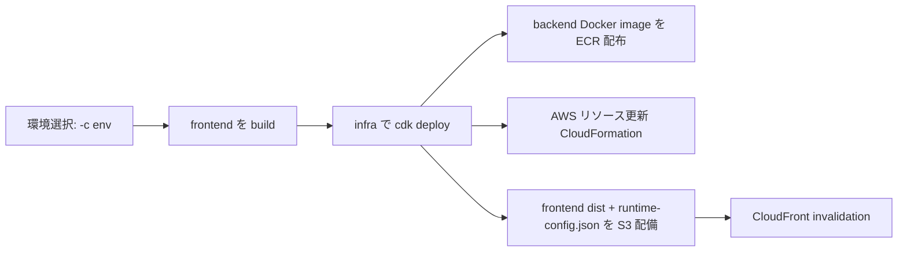

# Spec: 010-depoyment-manual

## 概要
- モノレポ（`frontend/`・`backend/`・`infra/`）を AWS へ一連デプロイするための手順書を整備し、実行順序・前提条件・確認観点を明確化する。
- 対象は「ローカル開発手順」ではなく、「AWS へのプロビジョニング / ビルド / デプロイ手順」の定義である。
- 手順書は `docs/development/aws-deployment-manual.md` として追加し、プロジェクトルート `README.md` から辿れるようにする。

### 想定デプロイフロー

## 背景
- 現在の実装では、`infra/lib/infra-stack.ts` が `frontend/dist` の存在を必須としており、未生成のまま `cdk deploy` すると失敗する。
- `backend/` のコンテナイメージは `imagedeploy.DockerImageDeployment` により、`infra` の CDK 実行時に ECR へ配布される。
- 一方、`s3deploy.BucketDeployment` は `frontend/` の成果物を配備する機能であり、React のビルド自体は行わない。
- 既存情報は `infra/README.md`・`docs/infra/*` に分散しており、モノレポ全体の実行順序を 1 本化した運用手順が不足している。

## 目的
- AWS デプロイの標準手順を 1 つの文書に集約し、担当者間で同じ前提で実行できる状態にする。
- 実装と整合しない誤手順（例: frontend 未ビルドでの deploy）を防ぐ。
- `prod` 中心の実行例を基準に、環境切替（`-c env=<dev|stg|prod>`）の実行ルールを明文化する。

## スコープ
- 変更対象領域は **複数領域**（`docs/`、ルート `README.md`）。
- `docs/`
  - `docs/development/aws-deployment-manual.md` を新規追加する。
  - 必要に応じて `docs/README.md` から辿れるようにリンクを追加する。
- ルート `README.md`
  - 新規手順書へのリンクを追加する。
- `infra/`・`backend/`・`frontend/`
  - 本 feature では原則コード変更を行わず、既存実装に基づいて手順を定義する。

## 対象外
- `frontend/` のローカル開発（`npm run dev`）に特化した説明。
- CI/CD パイプライン（CodePipeline / GitHub Actions など）の新規設計。
- 新規 AWS 構成要素の追加（WAF、独自ドメイン、ACM など）。
- `infra/lib/config/environment-config.ts` の環境値自体の変更（新環境追加・アカウント変更）。
- アプリケーション機能（Todo API / UI）の実装変更。

## ユーザーストーリー / 利用シナリオ
- インフラ担当者として、`frontend` と `infra` の実行順序を誤らずに、AWS へ再現可能にデプロイしたい。
- 開発者として、`cdk deploy` 実行時に backend イメージ配布と frontend 静的配備がどのように行われるかを理解したい。
- 運用担当者として、デプロイ後に CloudFront / Cognito / API の確認手順を同じ文書から実施したい。

## 機能要件
- FR-DOC-01: 手順書は `docs/development/aws-deployment-manual.md` とし、モノレポ全体の AWS デプロイを対象とすることを冒頭で明示すること。
- FR-DOC-02: 手順書に、実行前提（AWS 認証、Docker 起動、Node/npm、AWS CDK、必要権限）を明記すること。
- FR-DOC-03: 環境指定は `-c env=<dev|stg|prod>` を使用すること、`env` 未指定はエラーとなることを明記すること。
- FR-DOC-04: `infra/lib/config/environment-config.ts` は「環境マッピング定義」であり、通常デプロイ時は毎回編集しない運用前提を明記すること。
- FR-DOC-05: `frontend/` の `npm run build` を `cdk deploy` 前の必須手順として明記すること（`frontend/dist` 必須）。
- FR-DOC-06: `infra/` の `cdk deploy` 実行で、以下が同時に実施されることを明記すること。
  - backend Docker イメージの ECR 配布（`imagedeploy.DockerImageDeployment`）
  - CloudFormation による AWS リソース更新
  - `frontend/dist` と `runtime-config.json` の S3 配備（`BucketDeployment`）
- FR-DOC-07: 推奨実行順序として、`cdk synth` / `cdk diff`（任意だが推奨）→ `cdk deploy` を示すこと。コマンド例は `prod` 中心（例: `-c env=prod`）で記載すること。
- FR-DOC-08: デプロイ後確認として、少なくとも以下を含めること。
  - CloudFront ドメイン到達
  - Cognito Hosted UI 関連出力値確認
  - `/api/*` 経路の疎通確認
- FR-DOC-09: 代表的な失敗ケースと原因切り分けを記載すること（例: `frontend/dist` 未生成、Docker 未起動、権限不足）。
- FR-DOC-10: ルート `README.md` から当該手順書へ 1 クリックで到達できるリンクを追加すること。
- FR-DOC-11: `imagedeploy.DockerImageDeployment()` のビルド実行には、ローカルでコンテナランタイム（例: Docker Desktop / Rancher Desktop）が起動していることを明記すること。
- FR-DOC-12: 初回セットアップ手順として `cdk bootstrap` の簡単な記載（実行目的と最小実行例）を含めること。

## 非機能要件
- 正確性
  - 手順は既存実装（`infra/lib/infra-stack.ts`、各 Construct、既存 README）と矛盾しないこと。
- 再現性
  - 新しい担当者が手順書のみで同一結果を再現できること。
- 運用性
  - 実行コマンド、作業ディレクトリ、確認ポイントが明確に分離されていること。
- セキュリティ
  - 手順書に秘密情報（アクセスキー実値、シークレット実値）を記載しないこと。
- 保守性
  - 将来の構成変更時に追随しやすいよう、サービス名より責務単位で手順を記述すること。

## 受け入れ条件
- `docs/development/aws-deployment-manual.md` が日本語で追加されている。
- 手順書に `frontend build` 必須、および `cdk deploy` による backend/ECR + frontend/S3 配備の関係が明記されている。
- 手順書に `imagedeploy.DockerImageDeployment()` 実行前提として、ローカルのコンテナランタイム起動要件（例: Docker Desktop / Rancher Desktop）が明記されている。
- 手順書に `-c env=<dev|stg|prod>` の指定ルールと、未指定時の失敗前提が明記されている。
- 手順書のコマンド例が `prod` 中心（`-c env=prod`）で記載されている。
- 手順書に初回セットアップとして `cdk bootstrap` の簡単な説明が記載されている。
- 手順書にデプロイ後の確認手順（CloudFront/Cognito/API）が記載されている。
- ルート `README.md` に当該手順書へのリンクが追加されている。
- 記載内容が既存の `infra/README.md`・`docs/infra/*` と整合している。

## 制約
- 既存の環境切替方式（`-c env=<dev|stg|prod>`）を変更しないこと。
- 既存 CDK 実装（`imagedeploy`、`BucketDeployment`、CloudFront + S3 + ALB 構成）を前提に記述すること。
- 手順記載の主軸は `prod` 環境の例示とすること。
- 文書は日本語で作成すること。
- 変更範囲は本 feature に必要なドキュメントおよびリンク追加に限定すること。

## 依存関係
- `infra/lib/infra-stack.ts`（`frontend/dist` 必須チェック、CloudFront/Cognito 出力、frontend/backend 配備連携）
- `infra/lib/constructs/backend-image-deployment-construct.ts`（backend イメージ配布）
- `infra/lib/constructs/todo-frontend-deployment-construct.ts`（frontend 成果物配備）
- `infra/README.md`（実行時注意・環境切替ルール）
- `docs/infra/ecs-aurora-runtime-baseline.md`（配信経路と実行基盤）
- ルート `README.md`（ドキュメント導線）
